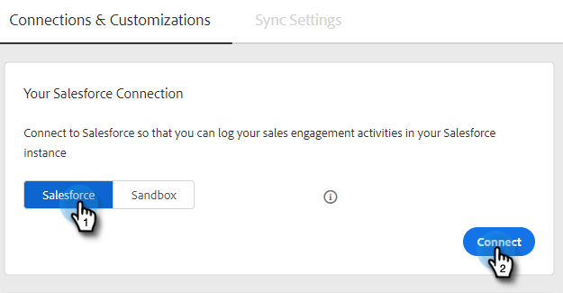
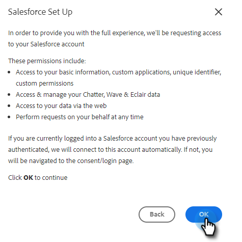

# Conecte su cuenta de ventas de Marketo a Salesforce {#connect-your-marketo-sales-account-to-salesforce}

Siga estos sencillos pasos para conectar Marketo Sales Connect con Salesforce.

## Conexión como administrador {#how-to-connect-as-an-admin}

1. Haga clic en el icono del engranaje y seleccione **Configuración**.

   

1. En Configuración de administración, haga clic en **Salesforce**.

   

1. En la pestaña Conexiones y personalizaciones , haga clic en **Salesforce** then **Connect**.

   

1. Haga clic en **OK**.

   

1. Si ya ha iniciado sesión en Salesforce, estará conectado. Si no lo está, se le pedirá que inicie sesión.

## Cómo conectarse como no administrador {#how-to-connect-as-a-non-admin}

1. Haga clic en el icono del engranaje y seleccione **Configuración**.

   

1. En Mi cuenta, seleccione **Salesforce**.

1. En la pestaña Conexiones y personalizaciones , haga clic en **Salesforce** then **Connect**.

   

1. Haga clic en **OK**.

   

1. Si ya ha iniciado sesión en Salesforce, estará conectado. Si no lo está, se le pedirá que inicie sesión.
