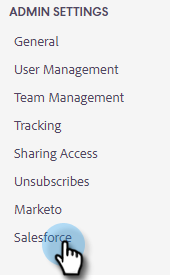
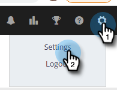

# Conectar su cuenta de [!DNL Sales Insight Actions] a [!DNL Salesforce] {#connect-your-sales-insight-actions-account-to-salesforce}

Siga estos sencillos pasos para conectar la cuenta de [!DNL Sales Insight Actions] a [!DNL Salesforce].

## Cómo conectarse como administrador {#how-to-connect-as-an-admin}

1. Haga clic en el icono del engranaje y seleccione **[!UICONTROL Configuración]**.

   

1. En [!UICONTROL Configuración de administración], haga clic en **[!UICONTROL Salesforce]**.

   

1. En la pestaña [!UICONTROL Conexiones y personalizaciones], haz clic en **[!UICONTROL Salesforce]** y luego en **[!UICONTROL Conectar]**.

   

1. Haga clic en **[!UICONTROL Aceptar]**.

   

1. Si ya ha iniciado sesión en Salesforce, estará conectado. Si no lo está, se le pedirá que inicie sesión.

## Cómo conectarse sin ser administrador {#how-to-connect-as-a-non-admin}

1. Haga clic en el icono del engranaje y seleccione **[!UICONTROL Configuración]**.

   

1. En [!UICONTROL Mi cuenta], seleccione **[!UICONTROL Salesforce]**.

1. En la pestaña [!UICONTROL Conexiones y personalizaciones], haz clic en **[!UICONTROL Salesforce]** y luego en **[!UICONTROL Conectar]**.

   

1. Haga clic en **[!UICONTROL Aceptar]**.

   

1. Si ya ha iniciado sesión en Salesforce, estará conectado. Si no lo está, se le pedirá que inicie sesión.
