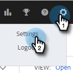
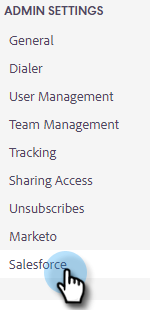
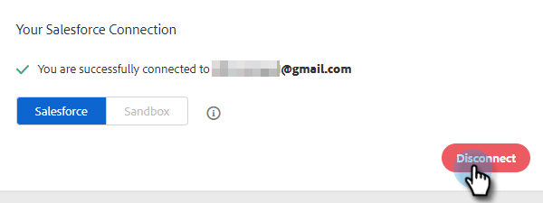

# Desconectar [!DNL Salesforce] De [!DNL Sales Insight Actions] {#disconnect-salesforce-from-sales-insight-actions}

En ocasiones, es posible que deba desconectar su cuenta de [!DNL Salesforce] de su cuenta de [!DNL Sales Insight Actions]. Así es cómo se hace.

## Cómo desconectarse de [!UICONTROL Salesforce] como administrador {#how-to-disconnect-from-salesforce-as-an-admin}

1. En [!DNL Sales Insight Actions], haga clic en el icono de engranaje en la esquina superior derecha y seleccione **[!UICONTROL Configuración]**.

   

1. En [!UICONTROL Configuración de administración], haga clic en **[!UICONTROL Salesforce]**.

   

1. En la ficha [!UICONTROL Conexiones y personalizaciones], haga clic en **[!UICONTROL Desconectar]**.

   

## Cómo desconectarse de [!DNL Salesforce] si no es el administrador {#how-to-disconnect-from-salesforce-as-a-non-admin}

1. En [!DNL Sales Insight Actions], haga clic en el icono de engranaje en la esquina superior derecha y seleccione **[!UICONTROL Configuración]**.

   

1. En [!UICONTROL Mi cuenta], seleccione **[!UICONTROL Salesforce]**.

PICC

1. En la ficha [!UICONTROL Conexiones y personalizaciones], haga clic en **[!UICONTROL Desconectar]**.

PICC
