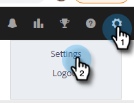

# Configuración de sincronización de Salesforce {#salesforce-sync-settings}

## Registro de actividad de correo electrónico en Salesforce mediante API {#logging-email-activity-to-salesforce-via-api}

Esta funcionalidad requiere que esté en la edición Enterprise/Unlimited de Salesforce o en la edición Professional si ha comprado Integration a través de la API de servicios web.

>[!PREREQUISITES]
>
>Salesforce y Marketo Sales deben estar conectados.

1. En Ventas de Marketo, haga clic en el icono de engranaje y seleccione **Configuración**.

   

1. En Configuración de administración (o &quot;Mi cuenta&quot; si no es administrador), haga clic en **Salesforce**.

   

1. Haga clic en el **Configuración de sincronización** pestaña .

   

1. Haga clic en la flecha situada junto a Registrar actividad de correo electrónico en Salesforce.

   

1. Haga clic en el **API de Salesforce** pestaña . En esta tarjeta puede configurar su preferencia de información de registro en Salesforce. Haga clic en **Guardar** cuando haya terminado.

   

## Registro de actividades de correo electrónico en Salesforce mediante correo electrónico a Salesforce (BCC) {#logging-email-activity-to-salesforce-via-email-to-salesforce-bcc}

Una vez que active &quot;Email to Salesforce (BCC)&quot;, recibirá un CCO de sus correos electrónicos de ventas y los mensajes de correo electrónico se registrarán como actividades sobre oportunidades, posibles clientes y contactos.

>[!PREREQUISITES]
>
>Salesforce y Marketo Sales deben estar conectados.

**Para registrar sus correos electrónicos en Salesforce por correo electrónico (BCC)**

1. En Ventas de Marketo, haga clic en el icono de engranaje y seleccione **Configuración**.

   

1. En Configuración de administración (o &quot;Mi cuenta&quot; si no es administrador), haga clic en **Salesforce**.

   

1. Haga clic en el **Configuración de sincronización** pestaña .

   

1. Haga clic en el **Correo electrónico a Salesforce (BCC)** y haga clic en **Activar**.

   

Si, por alguna razón, su dirección de correo electrónico a Salesforce no se introduce, siga estos pasos para activar la función de CCO en su cuenta de Salesforce:

1. Inicie sesión en la instancia de Salesforce.
1. Busque su nombre de usuario en la esquina superior derecha y seleccione la barra desplegable.
1. Select **Mis ajustes**.
1. Select **Correo electrónico**.
1. Select **Mi correo electrónico a Salesforce**.
1. En esta página, verá un campo etiquetado como &quot;Dirección de correo electrónico a Salesforce&quot;. Si no hay nada rellenado junto a él, desplácese hacia abajo hasta &quot;Mis direcciones de correo electrónico aceptables&quot;.
1. Introduzca las direcciones de correo electrónico que desea que sean CCO.
1. Haga clic en **Guardar cambios**.

**No encuentro mi correo electrónico para Salesforce en mi configuración**

Si no ve Mi correo electrónico a Salesforce en Configuración, es posible que el administrador no lo haya habilitado. Esto puede ocurrir si su equipo es nuevo en Salesforce o si su equipo nunca ha utilizado la dirección de CCO que proporciona Salesforce.

>[!NOTE]
>
>Necesitará privilegios de administrador para configurarlo.

1. Haga clic en **Configuración**.
1. Haga clic en **Administración de correo electrónico**.
1. Haga clic en **Enviar correo electrónico a Salesforce**.
1. Haga clic en **Editar**.
1. Marque la casilla junto a &quot;Activo&quot;.
1. Haga clic en **Guardar**.

## Sincronizar tareas/recordatorios de ventas de Marketo con tareas de Salesforce {#sync-marketo-sales-tasks-reminders-to-salesforce-tasks}

1. En Ventas de Marketo, haga clic en el icono de engranaje y seleccione **Configuración**.

   

1. En Configuración de administración (o &quot;Mi cuenta&quot; si no es administrador), haga clic en **Salesforce**.

   

1. Haga clic en el **Configuración de sincronización** pestaña .

   

1. Haga clic en la flecha situada junto a Sincronizar tareas/recordatorios de ventas de Marketo con tareas de Salesforce.

   

1. Elija la opción deseada (&quot;No sincronizar con las tareas de Salesforce&quot; está seleccionada de forma predeterminada).

   
