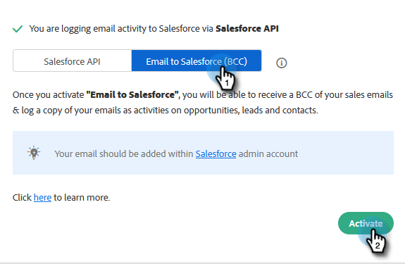

# Sincronizar actividades de ventas con Salesforce {#sync-sales-activities-to-salesforce}

Puede configurar las Acciones Configuración de sincronización de Salesforce para registrar las actividades de correo electrónico y llamada en Salesforce. Esto proporciona una mejor visibilidad a los equipos que trabajan fuera de su CRM y permite a los administradores utilizar estas actividades para crear informes personalizados de Salesforce para rastrear el rendimiento de sus equipos.

## Registro de actividades de correo electrónico en Salesforce mediante API {#logging-email-activity-to-salesforce-via-api}

Esta funcionalidad requiere que esté en la edición Enterprise/Unlimited de Salesforce o en la edición Professional si ha adquirido Integration mediante la API de servicios web.

>[!PREREQUISITES]
>
>Las acciones de Salesforce y Sales Insight deben estar conectadas.

1. En Acciones de Insight de ventas, haga clic en el icono de engranaje y seleccione **Configuración**.

   

1. En Configuración de administración (o &quot;Mi cuenta&quot; si no eres administrador), haz clic en **Salesforce**.

   

1. Haga clic en la ficha **Configuración de sincronización**.

   

1. Haga clic en la flecha situada junto a Registrar actividad de correo electrónico en Salesforce.

   

1. Haga clic en la ficha **API de Salesforce**. En esta tarjeta puede configurar sus preferencias para registrar información en Salesforce. Haga clic en **Guardar** cuando termine.

   

## Registro de actividades de correo electrónico en Salesforce mediante correo electrónico a Salesforce (CCO) {#logging-email-activity-to-salesforce-via-email-to-salesforce-bcc}

Una vez que active &quot;Email to Salesforce (BCC)&quot;, recibirá un CCO de sus correos electrónicos de ventas y sus correos electrónicos se registrarán como actividades en oportunidades, posibles clientes y contactos.

>[!PREREQUISITES]
>
>Las acciones de Salesforce y Sales Insight deben estar conectadas.

**Para registrar sus correos electrónicos en Salesforce por correo electrónico (CCO)**

1. En Marketo Sales, haga clic en el icono del engranaje y seleccione **Configuración**.

   

1. En Configuración de administración (o &quot;Mi cuenta&quot; si no eres administrador), haz clic en **Salesforce**.

   

1. Haga clic en la ficha **Configuración de sincronización**.

   

1. Haga clic en la ficha **Correo electrónico a Salesforce (CCO)** y luego en **Activar**.

   

Si, por alguna razón, la dirección de correo electrónico a Salesforce no se extrae, siga estos pasos para activar la función CCO en su cuenta de Salesforce:

1. Inicie sesión en la instancia de Salesforce.
1. Busque su nombre de usuario en la esquina superior derecha y seleccione la barra desplegable.
1. Seleccione **Mi configuración**.
1. Seleccione **correo electrónico**.
1. Seleccione **Mi correo electrónico a Salesforce**.
1. En esta página, verá un campo etiquetado como &quot;Correo electrónico a dirección de Salesforce&quot;. Si no hay nada rellenado junto a él, desplácese hacia abajo hasta &quot;Mis direcciones de correo electrónico aceptables&quot;.
1. Introduzca las direcciones de correo electrónico que desea incluir en la lista de destinatarios copiados ocultos (CCO).
1. Haga clic en **Guardar cambios**.

**No puedo encontrar mi correo electrónico a Salesforce en Mi configuración**

Si no ve Mi correo electrónico a Salesforce en su configuración, es posible que el administrador no lo haya habilitado. Esto puede suceder si su equipo es nuevo en Salesforce o si no ha utilizado nunca la dirección de CCO que Salesforce proporciona.

>[!NOTE]
>
>Necesitará privilegios de administrador para configurar esto.

1. Haga clic en **Configuración**.
1. Haga clic en **Administración de correo electrónico**.
1. Haga clic en **Correo electrónico a Salesforce**.
1. Haga clic en **Editar**.
1. Marque la casilla junto a &quot;Activo&quot;.
1. Haga clic en **Guardar**.

## Sincronizar tareas/recordatorios de acciones de Insight de ventas con tareas de Salesforce {#sync-sales-insight-actions-tasks-reminders-to-salesforce-tasks}

1. En Acciones de Insight de ventas, haga clic en el icono de engranaje y seleccione **Configuración**.

   

1. En Configuración de administración (o &quot;Mi cuenta&quot; si no eres administrador), haz clic en **Salesforce**.

   

1. Haga clic en la ficha **Configuración de sincronización**.

   

1. Haga clic en la flecha situada junto a Sincronizar tareas de ventas/recordatorios de Marketo con tareas de Salesforce.

   

1. Elija la opción que desee (&quot;No sincronizar con tareas de Salesforce&quot; está seleccionada de forma predeterminada).

   

## Sincronización de tareas de acciones de Insight de ventas con Salesforce por primera vez {#syncing-sales-insight-ations-tasks-with-salesforce-for-the-first-time}

Cuando active por primera vez la sincronización entre las acciones de Sales Insight y las tareas de Salesforce, importaremos sus tareas de Salesforce. No transferiremos a Salesforce las tareas actuales que tenga en Acciones de Insight de ventas. Para reducir el desorden y los duplicados, las únicas tareas que se sincronizan con las acciones de Sales Insight en Salesforce son las creadas después de sincronizar las acciones de Sales Insight con SFDC.

Esto es lo que sucede cuando sincroniza las acciones de Sales Insight y las tareas de SFDC:

* Tan pronto como haga clic en guardar en las tareas que se sincronizan, comienzan a sincronizarse. Inicialmente, esto llevará algún tiempo.

* Cualquier recordatorio que se haya actualizado o creado en las últimas 24 horas se recuperará de SFDC a las acciones de Sales Insight. La sincronización se basa en la fecha de vencimiento y todas esas tareas se sincronizarán en el back-end, pero en el Centro de comandos, solo verá las tareas con vencimiento hoy y mañana.

* Si la sincronización se ha activado anteriormente y elimina cualquier tarea de SFDC, cualquier elemento que se haya eliminado en los últimos 15 días se eliminará del Centro de comandos.

* Siempre que la sincronización esté habilitada, sincronizaremos constantemente las tareas entre Sales Insight Actions y SFDC.

* Después de la sincronización inicial, cualquier tarea que cree, edite, complete o elimine en las acciones de Sales Insight se sincronizará con la lista de tareas de Salesforce. Además, cualquier elemento que se cree, edite, complete o elimine en Salesforce actualizará la lista de tareas en Acciones de Insight de ventas.

* Para activar esta sincronización, simplemente marque la casilla de sincronización en la página Configuración de la aplicación web.
