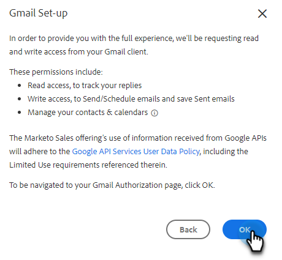

# Conectar con Gmail {#connect-to-gmail}

Conectarse a Gmail significa que recibirá seguimiento de respuestas, acceso al canal de entrega de Gmail, la capacidad de programar correos electrónicos en Gmail y enviar conformidad.

>[!CAUTION]
>
>Si usted es [uso de filtros](https://support.google.com/mail/answer/6579?hl=en#zippy=%2Ccreate-a-filter%2Cedit-or-delete-filters){target="_blank"} Para que las reglas de la cuenta de Gmail marquen automáticamente los correos electrónicos como leídos, esto puede causar problemas con el seguimiento de respuestas. Se recomienda desactivar cualquier regla que marque automáticamente los correos electrónicos como leídos al utilizar el seguimiento de respuestas con Gmail.

1. En Marketo Sales, haga clic en el icono de engranaje y seleccione **Configuración**.

   

1. En Mi cuenta, seleccione **Configuración de correo electrónico**.

   

1. Haga clic en **Conexión de correo electrónico** pestaña.

   

1. Clic **Primeros pasos**.

   

1. Seleccionar **Uso Gmail para enviar correos electrónicos** y haga clic en **Siguiente**.

   

1. Clic **OK**.

   

1. Si ya ha iniciado sesión en Gmail, elija la cuenta a la que desea conectarse. Si no es así, escriba su dirección de Gmail y haga clic en **Siguiente**. En este ejemplo, todavía no hemos iniciado sesión.

   

1. Introduzca la contraseña y haga clic en **Siguiente**.

   

1. Clic **Permitir**.

   

   Puede utilizar esta conexión para rastrear correos electrónicos y también como canal de envío.

>[!NOTE]
>
>Gmail aplica sus propios límites de envío. [Obtenga más información aquí](/help/marketo/product-docs/marketo-sales-connect/email/email-delivery/email-connection-throttling.md#email-provider-limits).
