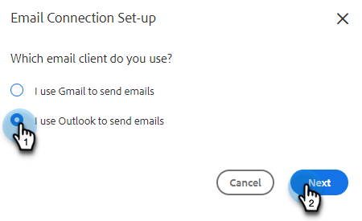

# Conectarse a Outlook {#connect-to-outlook}

Obtenga información sobre cómo conectar su cuenta de acciones de perspectiva de ventas con Outlook.

>[!NOTE]
>
>Cada usuario debe conectarse a Outlook desde su cuenta de ventas de Marketo.

## Conectarse a Outlook Online {#connecting-to-outlook-online}

La conexión a Outlook significa que recibirá seguimiento de respuestas, acceso al canal de entrega de Outlook, la capacidad de programar correos electrónicos en Outlook y enviar conformidad.

1. En Marketo Sales, haga clic en el icono del engranaje y seleccione **Configuración**.

   

1. En Mi cuenta, seleccione **Configuración de correo electrónico**.

   

1. Haga clic en la ficha **Conexión de correo electrónico**.

   

1. Haga clic en **Comenzar**.

   

1. Seleccione **Utilizo Outlook para enviar mensajes de correo electrónico** y haga clic en **Siguiente**.

   

1. Seleccione la versión de Outlook que está utilizando y haga clic en **Siguiente**. En este ejemplo elegimos Outlook en línea.

   

   <table> 
    <tbody>
     <tr>
      <td><strong>Outlook Online</strong></td> 
      <td>También conocido como Exchange Online</td> 
     </tr>
     <tr>
      <td><strong>Exchange On-Premise</strong></td> 
      <td>Incluye Exchange 2013 y 2016</td> 
     </tr>
    </tbody>
   </table>

   >[!NOTE]
   >
   >Marketo no admite cuentas híbridas de Exchange en este momento.

1. Haga clic en **Aceptar**.

   

1. Si no ha iniciado sesión en Outlook, escriba su información de inicio de sesión y haga clic en **Siguiente**. Si lo estás, elige la cuenta a la que deseas conectarte y haz clic en **Siguiente**. En este ejemplo, ya hemos iniciado sesión.

   

1. Haga clic en **Aceptar**.

   

   Puede utilizar esta conexión para rastrear correos electrónicos y también como canal de envío.

   >[!NOTE]
   >
   >Outlook Online (Office365) aplica sus propios límites de envío. [Obtenga más información aquí](/help/marketo/product-docs/marketo-sales-connect/email/email-delivery/email-connection-throttling.md#email-provider-limits).

## Conectarse a Exchange local {#connecting-to-exchange-on-premise}

La conexión a Exchange local significa que recibirá seguimiento de respuestas, acceso al canal de entrega de Outlook, la capacidad de programar correos electrónicos en Outlook y enviar conformidad.

1. En Marketo Sales, haga clic en el icono del engranaje y seleccione **Configuración**.

   

1. En Mi cuenta, seleccione **Configuración de correo electrónico**.

   

1. Haga clic en la ficha **Conexión de correo electrónico**.

   

1. Haga clic en **Comenzar**.

   

1. Seleccione **Utilizo Outlook para enviar mensajes de correo electrónico** y haga clic en **Siguiente**.

   

1. Seleccione la versión de Outlook que está utilizando y haga clic en **Siguiente**. En este ejemplo elegimos Exchange On-Premise.

   

   <table> 
    <tbody>
     <tr>
      <td><strong>Outlook Online</strong></td> 
      <td>También conocido como Exchange Online</td> 
     </tr>
     <tr>
      <td><strong>Exchange On-Premise</strong></td> 
      <td>Incluye Exchange 2013 y 2016</td> 
     </tr>
    </tbody>
   </table>

1. Escriba sus credenciales y haga clic en **Conectar**.

   

   >[!NOTE]
   >
   >Si desactiva Detección automática en la lista desplegable Versión de Exchange, tendrá que solicitar a su departamento de TI la URL de Exchange.

   Puede utilizar esta conexión para rastrear correos electrónicos y también como canal de envío.

   >[!NOTE]
   >
   >Al utilizar Exchange local, su equipo de TI establecerá el límite de envío de correo electrónico.

## Obtener permiso para conectarse a Outlook Online {#getting-permission-to-connect-to-outlook-online}

Es posible que tenga que trabajar con su equipo de TI para obtener permiso para permitir que Marketo Sales se conecte a su cuenta de Outlook Online (Microsoft 365).

>[!NOTE]
>
>Informe al equipo de TI que administra su cuenta de Microsoft 365 de que la aplicación a la que necesita acceder es &quot;Marketo Sales Connect&quot;.

En función de las preferencias de su equipo informático y de la configuración actual, es mejor consultar con él sobre cómo conceder acceso. A continuación se muestran algunos artículos que pueden ayudar a guiar la conversación.

* Consentimiento global: [aplicaciones integradas y Azure AD para administradores de Microsoft 365](https://learn.microsoft.com/en-us/microsoft-365/enterprise/integrated-apps-and-azure-ads?view=o365-worldwide){target="_blank"}
* Consentimiento de usuario: [Configurar el consentimiento de los usuarios a las aplicaciones](https://learn.microsoft.com/en-us/azure/active-directory/manage-apps/configure-user-consent?tabs=azure-portal&amp;pivots=portal){target="_blank"}
* Consentimiento de administrador: [Configurar el flujo de trabajo del consentimiento de administrador](https://learn.microsoft.com/en-us/microsoft-365/admin/misc/user-consent?source=recommendations&amp;view=o365-worldwide){target="_blank"}
* Activar o desactivar el consentimiento del usuario: [Administrar el consentimiento del usuario para las aplicaciones de Microsoft 365](https://learn.microsoft.com/en-us/microsoft-365/admin/misc/user-consent?source=recommendations&amp;view=o365-worldwide){target="_blank"}
* Administración con Microsoft Defender: [Administrar aplicaciones de OAuth](https://learn.microsoft.com/en-us/defender-cloud-apps/manage-app-permissions){target="_blank"}
