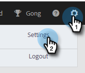

# Verifique su correo electrónico {#verify-your-email}

Si tiene una identidad de correo electrónico no verificada, siga los pasos a continuación.

1. Haga clic en el icono de engranaje en la parte superior derecha y seleccione **Settings**.

   

1. En Mi cuenta, haga clic en **Configuración de correo electrónico**.

   

1. En Dirección y firma, busque el correo electrónico que desea verificar y haga clic en **Reenviar correo electrónico de verificación**. Se enviará un nuevo correo electrónico de verificación.

   

1. Haga clic en **Volver a enviar**.

   

1. A continuación, el destinatario abre el correo electrónico y sigue los pasos para verificar la dirección de correo electrónico.

   

>[!NOTE]
>
>Si no recibe el correo electrónico de verificación, compruebe su carpeta de correo no deseado. Si no está allí, póngase en contacto con el [Soporte de Marketo](https://nation.marketo.com/t5/Support/ct-p/Support).
