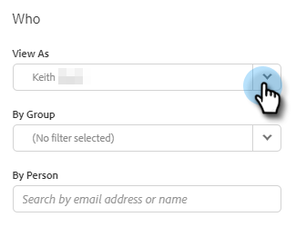
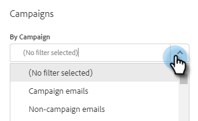

# Información general de búsqueda avanzada {#advanced-search-overview}

Al utilizar la búsqueda avanzada para dirigirse a los posibles clientes que hayan visto, hecho clic o respondido a correos electrónicos, puede crear una lista de objetivos de los posibles clientes más comprometidos.

## Cómo acceder a la búsqueda avanzada {#how-to-access-advanced-search}

1. En la aplicación web, haga clic en **Centro de comandos**.

   

1. Haga clic en **Correos electrónicos**.

   

1. Elija la pestaña correspondiente.

   

1. Haga clic en Búsqueda avanzada.

   

## Filtros {#filters}

**Fecha**

Elija el intervalo de fechas para la búsqueda. Las fechas preestablecidas se actualizan según el estado de correo electrónico que elija (Enviado, No entregado, Pendiente).

**Quién**

Filtre por destinatario/remitente del correo electrónico en la sección Quién.

<table>
 <tr>
  <td><strong>Desplegable</strong></td>
  <td><strong>Descripción</strong></td>
 </tr>
 <tr>
  <td><strong>Ver como</strong></td>
  <td>Filtre por un remitente específico en la instancia de conexión de ventas (esta opción solo está disponible para administradores).</td>
 </tr>
 <tr>
  <td><strong>Por grupo</strong></td>
  <td>Filtre correos electrónicos por un grupo específico de destinatarios.</td>
 </tr>
 <tr>
  <td><strong>Por persona</strong></td>
  <td>Filtre por un destinatario específico.</td>
 </tr>
</table>

**When**

Elija por fecha de creación, fecha de entrega, fecha de error o fecha programada. Las opciones disponibles cambian según el estado del correo electrónico que elija (Enviado, No entregado, Pendiente).

**Campañas**

Filtre los correos electrónicos por participación en la campaña.

**Estado**

Hay tres estados de correo electrónico para elegir. Las opciones de tipo/actividad cambian según el estado seleccionado.

_**Estado: Enviado**_

Filtros por la actividad de correo electrónico enviada. Puede elegir vistas/sin vistas, clics/sin clics y/o respuestas/no respuestas.

_**Estado: Pendiente**_

Filtra por todos los correos electrónicos pendientes.

<table>
 <tr>
  <td><strong>Estado</strong></td>
  <td><strong>Descripción</strong></td>
 </tr>
 <tr>
  <td><strong>Programado</strong></td>
  <td>Correos electrónicos que se han programado desde la ventana de composición (Salesforce o la aplicación web), complementos de correo electrónico o una campaña.</td>
 </tr>
 <tr>
  <td><strong>Borradores</strong></td>
  <td>Correos electrónicos que están actualmente en estado de borrador. Los correos electrónicos requieren una línea de asunto y un destinatario para guardarse como borrador.</td>
 </tr>
 <tr>
  <td><strong>en curso</strong></td>
  <td>Correos electrónicos que están en proceso de envío. Los correos electrónicos no deben permanecer en este estado durante más de unos segundos.</td>
 </tr>
</table>

_**Estado: No entregado**_

Filtros por correos electrónicos que nunca se entregaron.

<table>
 <tr>
  <td><strong>Estado</strong></td>
  <td><strong>Descripción</strong></td>
 </tr>
 <tr>
  <td><strong>Error</strong></td>
  <td>Cuando un correo electrónico no se envía desde Sales Connect (entre los motivos comunes se incluyen: correos electrónicos que se envían a contactos cancelados de suscripción o bloqueados, o si hay un problema en rellenar los campos dinámicos).</td>
 </tr>
 <tr>
  <td><strong>Rechazados</strong></td>
  <td>Un correo electrónico se marca como rechazado cuando el servidor del destinatario lo rechaza. Aquí solo se muestran los correos electrónicos enviados a través de los servidores de Sales Connect.</td>
 </tr>
 <tr>
  <td><strong>Correo no deseado</strong></td>
  <td>Cuando el destinatario ha marcado el correo electrónico como correo no deseado (término común para correo electrónico no solicitado). Aquí solo se muestran los correos electrónicos enviados a través de los servidores de Sales Connect.</td>
 </tr>
</table>

## Búsquedas guardadas {#saved-searches}

A continuación se explica cómo crear una búsqueda guardada.

1. Una vez que todos los filtros estén establecidos, haga clic en **Guardar filtros como**.

   

1. Asigne un nombre a la búsqueda y haga clic en **Guardar**.

   

Las búsquedas guardadas estarán en la barra lateral de la izquierda.

