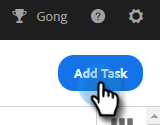

# Asignación de tareas a los integrantes del equipo {#assigning-tasks-to-team-members}

Si desea colaborar con otros integrantes del equipo, asignar tareas puede ser una buena manera de coordinar sus esfuerzos de prospección.

>[!NOTE]
>
>Solo puede asignar tareas para contactos compartidos.

1. En la aplicación web, haga clic en **[!UICONTROL Centro de comandos]**.

   

1. Haga clic en **[!UICONTROL Agregar tarea]**.

   

1. Seleccione el tipo de tarea.

   

1. Asigne un nombre a la tarea.

   

1. Seleccione a la persona de su equipo a la que desee asignar la tarea en el campo Asignar tarea.

   

1. Añada la persona a la que desee ponerse en contacto en el campo persona.

   

1. Seleccione la Fecha de vencimiento.

   

1. Establezca la Prioridad.

   

1. Agregue los detalles importantes que sean relevantes para su compañero de equipo (opcional) y haga clic en **[!UICONTROL Crear]**.

   
