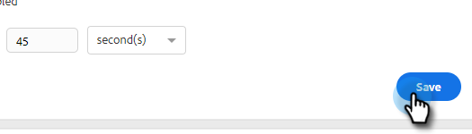

# Restricción de conexión de correo electrónico {#email-connection-throttling}

La integración de la cuenta de Sales Connect para enviar a través de los proveedores de correo electrónico de Exchange o Gmail ofrece una configuración optimizada y optimiza la capacidad de envío de correo electrónico para la comunicación de ventas 1:1. Sin embargo, para mantener los sistemas en buen estado y las cuentas seguras, Gmail y Exchange aplican límites de envío de correo electrónico. Estos límites pueden aumentarse o reducirse a discreción de los proveedores.

## Restricción de conexión de correo electrónico (Beta) {#email-connection-throttling-beta}

>[!AVAILABILITY]
>
>Esta función se encuentra actualmente en la versión beta. Para unirse a esta Beta, póngase en contacto con su gestor de éxito de los clientes.

La limitación de la conexión de correo electrónico permite a los administradores de Conexión de ventas configurar la tasa de envío de correos electrónicos al utilizar Gmail o Exchange como canal de envío, de modo que la tasa a la que se entregan los correos electrónicos al proveedor de canales de envío no supere los límites impuestos.

Cuando se exceden los límites de forma consistente, a veces se puede considerar que el proveedor de canales de envío tiene un comportamiento sospechoso, lo que provoca que los correos electrónicos fallen y, a veces, incluso que se deshabilite una cuenta.

**Notas/Puntos destacados**

* Se habilita automáticamente una vez que un usuario se conecta a Gmail o Exchange
* Se puede personalizar si desea aumentar o reducir la configuración de la recomendación para satisfacer sus necesidades
* Solo restringe los correos electrónicos enviados a través de Gmail o Exchange, no restringe el canal de envío personalizado
* La restricción Conexión de correo electrónico coloca en cola los correos electrónicos de cada usuario individual por separado, ya que cada usuario tiene su propia conexión con su proveedor de correo electrónico

**Configuración de la restricción de conexión de correo electrónico**

1. Haga clic en el icono del engranaje y seleccione **Configuración**.

   

1. En Configuración de administración, haga clic en **General**.

   

1. En la tarjeta de limitación de la conexión de correo electrónico de la derecha, haga clic en el botón **Habilitar restricción de correo electrónico** control deslizante.

   

1. En la tarjeta de limitación de la conexión de correo electrónico de la derecha, introduzca el tamaño del lote deseado de correos electrónicos que se enviarán al proveedor de canales de correo electrónico.

   

1. Establezca la cantidad de tiempo de espera antes de enviar cada lote. En este ejemplo elegimos 25 correos electrónicos cada 45 segundos.

   

1. Haga clic en **Guardar**.

   

Con los cambios guardados, todos los usuarios tendrán que enviar sus correos electrónicos en lotes a su cuenta de Gmail o Exchange conectada para su envío.

## Límites del proveedor de correo electrónico {#email-provider-limits}

**Outlook 365**

Empresa/Empresa

* 10 000 al día
* 30 por minuto
* 500 destinatarios por correo electrónico

Más información [se puede encontrar aquí](https://docs.microsoft.com/en-us/office365/servicedescriptions/exchange-online-service-description/exchange-online-limits?redirectedfrom=MSDN#RecipientLimits).

**Gmail**

* 2.000 por día (500 para juicios y cuentas marcadas)
* 2 correos electrónicos por segundo (límite de API)
* 2000 destinatarios por mensaje (un máximo de 500 para destinatarios externos)

Más información [se puede encontrar aquí](https://support.google.com/a/answer/166852?hl=en).

**Microsoft Exchange Server (2010, 2013)**

El departamento de TI de la organización establece límites, ya que el servidor está alojado por la organización. Póngase en contacto con el administrador de red o de sistema según corresponda para obtener más información.

>[!MORELIKETHIS]
>
>* [Descripción general del canal de entrega](/help/marketo/product-docs/marketo-sales-connect/email/email-delivery/delivery-channel-overview.md)
>* [Conexión de correo electrónico para usuarios de Gmail](/help/marketo/product-docs/marketo-sales-connect/email-plugins/gmail/email-connection-for-gmail-users.md)
>* [Conexión de correo electrónico para usuarios de Outlook](/help/marketo/product-docs/marketo-sales-connect/email-plugins/msc-for-outlook/email-connection-for-outlook-users.md)

