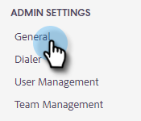

# Configurar un canal de entrega personalizado para su equipo {#set-up-a-custom-delivery-channel-for-your-team}

>[!NOTE]
>
>**Se requieren permisos de administrador**

>[!NOTE]
>
>* Además de configurar su servidor SMTP, su [identidad de correo electrónico debe verificarse](/help/marketo/product-docs/marketo-sales-insight/actions/getting-started/email-settings/verify-your-email.md) para poder enviar correos electrónicos.
>* Se recomienda trabajar con su equipo de TI o con el proveedor de servidores SMTP para obtener las credenciales de servidor adecuadas para su servidor SMTP.
>* No puede conectar su servidor Gmail y [!DNL Exchange] con las credenciales del servidor SMTP. Utilice nuestro servicio de conexión de correo electrónico para integrarse con estos proveedores.

1. Haga clic en el icono del engranaje y elija **[!UICONTROL Configuración]**.

   

1. En [!UICONTROL Configuración de administración], haga clic en **[!UICONTROL General]**.

   

1. Haga clic en la ficha **[!UICONTROL Canal de envío de equipo]**.

   

1. Escriba sus credenciales de servidor SMTP y haga clic en **[!UICONTROL Conectar]**.

   

   >[!NOTE]
   >
   >El servidor SMTP de equipo será el canal de entrega predeterminado de la identidad de correo electrónico predeterminada para todos los integrantes del equipo. Además, estará disponible como opción de canal de envío para todas las demás identidades de correo electrónico.

   >[!MORELIKETHIS]
   >
   >* [Conexión de correo electrónico para usuarios de Gmail](/help/marketo/product-docs/marketo-sales-connect/email-plugins/gmail/email-connection-for-gmail-users.md)
   >* [Conexión de correo electrónico para [!DNL Outlook] Usuarios](/help/marketo/product-docs/marketo-sales-connect/email-plugins/msc-for-outlook/email-connection-for-outlook-users.md)
