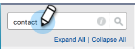

# Sincronización de la cancelación de suscripciones con Salesforce {#syncing-unsubscribes-with-salesforce}

## Requisitos para cancelar la suscripción para sincronizar con Salesforce {#requirements-for-unsubscribes-to-sync-to-salesforce}

* La sincronización de cancelación de suscripción debe estar habilitada (para sincronización por la noche)
* El campo de exclusión debe estar instalado en Salesforce
* Los registros de personas en Marketo Sales deben tener un ID de Salesforce

**Cancelación de suscripciones push**

Cuando se recopila una cancelación de suscripción en Marketo Sales, se envía a Salesforce en tiempo real y se actualiza cualquiera de los campos de exclusión que ha seleccionado para sincronizar. Si ha desactivado la sincronización de Salesforce, se continúa transfiriendo la cancelación de suscripción a la exclusión de correo electrónico.

**Cancelar suscripción**

Cuando habilite la sincronización de cancelación de suscripción (paso 3 a continuación), activará la sincronización por la noche. La sincronización se produce una vez al día, alrededor de las 20:00 PST. Sincronizará bidireccionalmente todas las cancelaciones de suscripción en MSE/ToutApp con el campo Exclusión de Salesforce.

## Configurar la cancelación de la suscripción a Salesforce {#configure-unsubscribe-sync-to-salesforce}

Los usuarios pueden decidir si desean sincronizar sus cancelaciones de suscripción con el campo de exclusión de correo electrónico estándar con el que Marketo también puede sincronizar, o si pueden sincronizarse con el campo de exclusión de ventas de Marketo para que se puedan diferenciar las cancelaciones de suscripción de ventas y las cancelaciones de suscripción de marketing.

1. Haga clic en el icono del engranaje y seleccione **Configuración**.

   

1. En Configuración de administración , seleccione **Cancelación de suscripción**.

   

1. Haga clic en el **Integraciones** pestaña . En Sincronizar con Salesforce, habilite la sincronización nocturna.

   

1. Seleccione el campo al que desee sincronizar.

   

   | Campo | Descripción |
   |---|---|
   | **Campo Sincronizar con exclusión de Salesforce** | Seleccionado de forma predeterminada, solo actualiza el campo Exclusión de Salesforce . |
   | **Campo Sincronizar con exclusión de ventas de Marketo** | Si desea separar las cancelaciones de suscripción de Ventas y Marketing, elija esta opción para actualizar las suscripciones adicionales [Campo Exclusión de ventas de Marketo .](#msoo) |

## Instalación del campo Exclusión en el diseño de página {#installing-the-opt-out-field-in-the-page-layout}

**No participar en el correo electrónico**

La exclusión de correo electrónico es un campo estándar de Salesforce que está disponible para instalar desde Salesforce. Debe ser administrador de Salesforce para instalarlo.

1. Vaya a [Salesforce.com](https://salesforce.com) e inicie sesión.

   

1. Haga clic en el nombre de usuario y seleccione **Configuración**.

   

1. En el cuadro de búsqueda rápida, busque Contacto o Posible cliente. En esta situación, se está instalando el campo en el diseño de página de contacto, pero se desea instalar para ambos registros de persona.

   

1. Select **Diseños de página**.

   

1. Select **Editar** junto al diseño de página al que desea añadir el campo .

   

1. Select **Campos**.

   

1. Arrastre y suelte la opción Desactivar correo electrónico en el diseño de página.

   

1. Haga clic en **Guardar**.

   

## Exclusión de ventas de Marketo {#marketo-sales-opt-out}

El campo Exclusión de ventas de Marketo es un campo personalizado que está disponible para los usuarios que han instalado las personalizaciones de ventas de Marketo.

Una vez que haya instalado correctamente las personalizaciones de ventas de Marketo en Salesforce, verá el campo Exclusión de ventas de Marketo disponible para usted.
