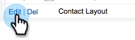

# Sincronizando cancelaciones de suscripción con [!DNL Salesforce] {#syncing-unsubscribes-with-salesforce}

Si desea sincronizar las cancelaciones de suscripción con un campo de exclusión en Salesforce, puede utilizar la sincronización de cancelación de suscripción de Salesforce.

## Requisitos para las cancelaciones de suscripción a la sincronización con Salesforce {#requirements-for-unsubscribes-to-sync-to-salesforce}

* La sincronización de cancelación de suscripción debe estar habilitada (para sincronización nocturna)
* El campo de exclusión debe estar instalado en [!DNL Salesforce]
* Los registros de persona de [!DNL Marketo Sales] deben tener un identificador de [!DNL Salesforce]

**Cancelaciones de suscripción push**

Cuando se recopila una cancelación de suscripción en [!DNL Marketo Sales], se inserta en [!DNL Salesforce] en tiempo real y se actualiza cualquiera de los campos de exclusión seleccionados para sincronizar. Si deshabilitaste la sincronización de [!DNL Salesforce], la cancelación de la suscripción se enviará al correo electrónico de exclusión.

**Cancelar la suscripción a la sincronización**

Cuando haya habilitado la sincronización de cancelación de suscripción (Paso 3 a continuación), activará la sincronización nocturna. La sincronización se produce una vez al día alrededor de las 20:00 PST. :00 Sincronizará bidireccionalmente todas las cancelaciones de suscripción en Marketo Sales con el campo de exclusión de Salesforce.

>[!NOTE]
>
>La sincronización de cancelación de suscripción con Salesforce sincronizará las cancelaciones de suscripción, pero no las cancelaciones de suscripción. Si desea eliminar una cancelación de suscripción de Marketo Sales y Salesforce, anule la selección de la cancelación de suscripción en Salesforce y elimine la cancelación de suscripción en Marketo Sales.

## Configurar la sincronización de cancelación de suscripción a [!DNL Salesforce] {#configure-unsubscribe-sync-to-salesforce}

Los usuarios pueden decidir si desean sincronizar sus cancelaciones de suscripción con el campo de exclusión de correo electrónico estándar con el que Marketo también puede sincronizarse, o bien pueden sincronizar con el campo de exclusión [!DNL Marketo Sales] para poder diferenciar las cancelaciones de suscripción de ventas y las cancelaciones de marketing.

1. Haga clic en el icono del engranaje y seleccione **[!UICONTROL Configuración]**.

   

1. En [!UICONTROL Configuración de administración], seleccione **[!UICONTROL Anular la suscripción]**.

   

1. Haga clic en la ficha **[!UICONTROL Integraciones]**. En [!UICONTROL Sincronizar con Salesforce], habilite la sincronización nocturna.

   

1. Seleccione el campo con el que desea sincronizar.

   

   | Campo | Descripción |
   |---|---|
   | **Sincronizar con el campo de exclusión [!DNL Salesforce]** | Seleccionado de forma predeterminada, solo actualiza el campo de exclusión [!DNL Salesforce]. |
   | **Sincronizar con el campo de exclusión [!DNL Marketo Sales]** | Si desea separar las cancelaciones de suscripción de ventas y marketing, elija esta opción para actualizar el campo de exclusión [[!DNL Marketo Sales] adicional.](#msoo) |

## Instalación del campo de exclusión en el diseño de página {#installing-the-opt-out-field-in-the-page-layout}

**Exclusión por correo electrónico**

Exclusión de correo electrónico es un campo estándar en [!DNL Salesforce] que está disponible para la instalación desde [!DNL Salesforce]. Debe ser administrador de [!DNL Salesforce] para instalarlo.

1. Vaya a [Salesforce.com](https://salesforce.com) e inicie sesión.

   

1. Haga clic en su nombre de usuario y seleccione **[!UICONTROL Configuración]**.

   

1. En el cuadro de búsqueda rápida, busque Contacto o Posible cliente. En esta situación, se está instalando el campo en el diseño de página Contacto, pero es recomendable instalar para ambos registros de persona.

   

1. Seleccione **[!UICONTROL Diseños de página]**.

   

1. Seleccione **[!UICONTROL Editar]** junto al diseño de página al que desee agregar el campo.

   

1. Seleccione **[!UICONTROL Campos]**.

   

1. Arrastre y suelte [!UICONTROL Exclusión por correo electrónico] en el diseño de página.

   

1. Haga clic en **[!UICONTROL Guardar]**.

   

## No participar de las Marketo Sales {#marketo-sales-opt-out}

El campo Exclusión de ventas de Marketo es un campo personalizado disponible para los usuarios que han instalado el paquete de Insight de ventas de Marketo [desde AppExchange](/help/marketo/product-docs/marketo-sales-insight/msi-for-salesforce/installation/install-marketo-sales-insight-package-in-salesforce-appexchange.md){target="_blank"}.

Una vez que haya instalado correctamente el paquete Marketo Sales Insight desde AppExchange a Salesforce, verá el campo Exclusión de ventas de Marketo disponible para usted.
