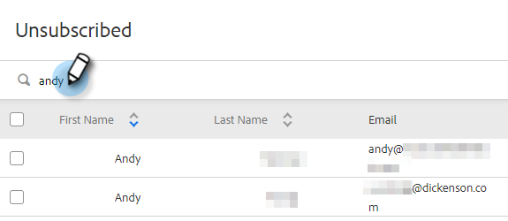

# Información general sobre la cancelación de la suscripción {#unsubscribe-overview}

Cada vez es más importante que las organizaciones cumplan con las leyes de privacidad de correo electrónico. Para ayudarle con esto, hemos realizado algunas mejoras en nuestra experiencia de cancelación de suscripción.

* Los vínculos de cancelación de suscripción se colocan en todos los correos electrónicos enviados desde Marketo Sales y Salesforce (esto no se aplica a los correos electrónicos personalizados enviados desde Outlook o Gmail).
* Los administradores pueden editar mensajes de cancelación de suscripción para todo el equipo
* La información de cancelación de suscripción se almacena en PDV
* La cancelación de suscripciones se puede realizar manualmente: Vínculo en el que se hizo clic, Sincronización de Salesforce y Devolución
* Nueva página de aterrizaje de enlace de cancelación de suscripción

## Cancelar suscripción a la página de aterrizaje del vínculo {#unsubscribe-link-landing-page}

Cuando una persona haga clic en su vínculo de cancelación de suscripción, se le dirigirá a una página de aterrizaje de cancelación de suscripción en la que podrá seleccionar de qué desea cancelar la suscripción y por qué.

Esta información se guarda en la vista de detalles de la persona para su visualización posterior.

## Cancelar suscripción de grupo {#unsubscribe-group}

Consulte y gestione todas las personas que han dejado de suscribirse en un solo lugar.

Utilice la barra de búsqueda para buscar cualquier persona que haya dejado de suscribirse.

Si es un administrador, puede ir al grupo de cancelación de suscripción para filtrar por Cancelación de suscripción de cuenta y ver todas las cancelaciones de suscripción que se han recopilado en la base de datos de personas.

## Cancelar suscripción a tarjeta de historial {#unsubscribe-history-card}

La tarjeta de historial de cancelación de suscripción ayuda a los administradores y usuarios a obtener información contextual sobre el historial de cancelación de suscripción de sus contactos. Vaya hasta allí accediendo a la ficha Personas y seleccionando una persona. Se encuentra en la parte inferior de la ficha Acerca de en la vista Detalles de persona.

>[!NOTE]
>
>Solo habrá una tarjeta de historial de cancelación de suscripción si la persona tiene _resuscrito_ en algún momento.

<table> 
 <colgroup> 
  <col> 
  <col> 
 </colgroup> 
 <tbody> 
  <tr> 
   <td><strong>Fecha</strong></td> 
   <td>
Muestra la fecha en la que se produjo la cancelación de la suscripción/resuscripción.
</td> 
  </tr> 
  <tr> 
   <td><strong>Detalles</strong></td> 
   <td>
Volver a suscribirse: Un administrador de Sales Connect eliminó manualmente la cancelación de la suscripción del registro de contacto. También puede mostrar algunos detalles relacionados con por qué se canceló la suscripción del contacto.

Cancelación de suscripción: Se canceló la suscripción del contacto.
</td> 
  </tr> 
  <tr> 
   <td><strong>Origen</strong></td> 
   <td>
Sincronización de Salesforce: La cancelación de la suscripción se capturó mediante una sincronización de Salesforce.

Manual: El usuario ha hecho clic en el botón de cancelación de suscripción para desactivar .

Vínculo en el que se hizo clic: El destinatario de un correo electrónico hizo clic en el vínculo de cancelación de suscripción.

"Nombre de administrador": El nombre de un administrador mostrará cuándo se realizó la acción para volver a suscribirse a los contactos. Esto permite a los usuarios saber quién eliminó la cancelación de suscripción.
</td> 
  </tr> 
 </tbody> 
</table>

>[!MORELIKETHIS]
>
>[Personalizar mensaje para cancelar la suscripción](/help/marketo/product-docs/marketo-sales-insight/actions/email/unsubscribes/customize-unsubscribe-link-message.md)
