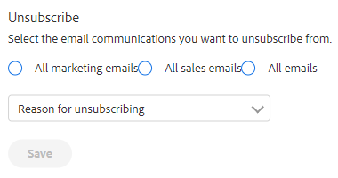
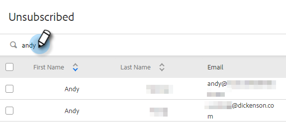
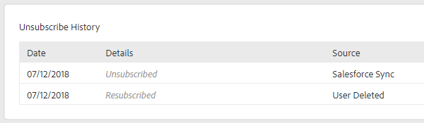

# Información general de cancelación de suscripción {#unsubscribe-overview}

Cada vez es más importante que las organizaciones cumplan con las leyes de privacidad de correo electrónico. Para ayudarle con esto, hemos realizado algunas mejoras en nuestra experiencia de cancelación de suscripción.

* Los vínculos de cancelación de suscripción se colocan en todos los correos electrónicos enviados desde [!DNL Marketo Sales] y [!DNL Salesforce] (esto no se aplica a los correos electrónicos personalizados enviados desde [!DNL Outlook] o Gmail)
* Los administradores pueden editar los mensajes de cancelación de suscripción para todo su equipo
* La información de cancelación de suscripción se almacena en PDV
* Las cancelaciones de suscripción se pueden realizar manualmente: clic en vínculo, sincronización de [!DNL Salesforce] y rechazos
* Nueva página de aterrizaje de vínculo de cancelación de suscripción

## Página de destino del vínculo de cancelación de suscripción {#unsubscribe-link-landing-page}

Cuando una persona hace clic en el vínculo de cancelación de suscripción, se le redirige a una página de aterrizaje de cancelación de suscripción en la que puede seleccionar desde qué desea cancelar la suscripción y por qué.

Esta información se guardará en la vista de detalles de la persona para su visualización posterior.

## Grupo de cancelación de suscripción {#unsubscribe-group}

Ver y administrar todas las personas que cancelaron su suscripción en un solo lugar.

Utilice la barra de búsqueda para buscar cualquier persona que no esté suscrita.

Si es administrador, puede ir al grupo Cancelar suscripción para filtrar por [!UICONTROL Cancelaciones de suscripción de cuenta] y ver todas las cancelaciones de suscripción que se han recopilado en su base de datos de personas.

## Tarjeta de historial de cancelación de suscripción {#unsubscribe-history-card}

La tarjeta [!UICONTROL Cancelar la suscripción al historial] ayuda a los administradores y usuarios a obtener información contextual sobre el historial de cancelación de suscripción de sus contactos. Vaya hasta allí. Para ello, vaya a la ficha [!UICONTROL Personas] y seleccione una persona. Se encuentra en la parte inferior de la ficha [!UICONTROL Acerca de] en la vista Detalles de la persona.

>[!NOTE]
>
>Solo habrá una tarjeta [!UICONTROL Cancelar la suscripción al historial] si la persona ha _vuelto a suscribirse_ en algún momento.

<table>
 <colgroup>
  <col>
  <col>
 </colgroup>
 <tbody>
  <tr>
   <td><strong>[!UICONTROL Fecha]</strong></td>
   <td>
Muestra la fecha en la que se canceló la suscripción o se volvió a suscribir.
</td>
  </tr>
  <tr>
   <td><strong>[!UICONTROL Detalles]</strong></td>
   <td>
Volver a suscribir: un administrador de [!DNL Sales Connect] quitó manualmente la cancelación de la suscripción del registro de contacto. También puede mostrar algunos detalles relacionados con el motivo por el que se canceló la suscripción al contacto.

Cancelar suscripción: se canceló la suscripción del contacto.
</td>
  </tr>
  <tr>
   <td><strong>[!UICONTROL Source]</strong></td>
   <td>
[!DNL Salesforce] Sincronizar: una sincronización de [!DNL Salesforce] capturó la cancelación de la suscripción.

Manual: el usuario ha hecho clic en el botón Cancelar la suscripción para darse de baja.

Vínculo en el que se hizo clic: el destinatario de un correo electrónico hizo clic en el vínculo para cancelar la suscripción.

"Nombre del administrador": Se mostrará un nombre de administrador cuando la acción fue volver a suscribir contactos. Esto permite a los usuarios saber quién eliminó la cancelación de la suscripción.
</td>
  </tr>
 </tbody>
</table>

>[!MORELIKETHIS]
>
>[Personalizar mensaje de vínculo de cancelación de suscripción](/help/marketo/product-docs/marketo-sales-insight/actions/email/unsubscribes/customize-unsubscribe-link-message.md)
