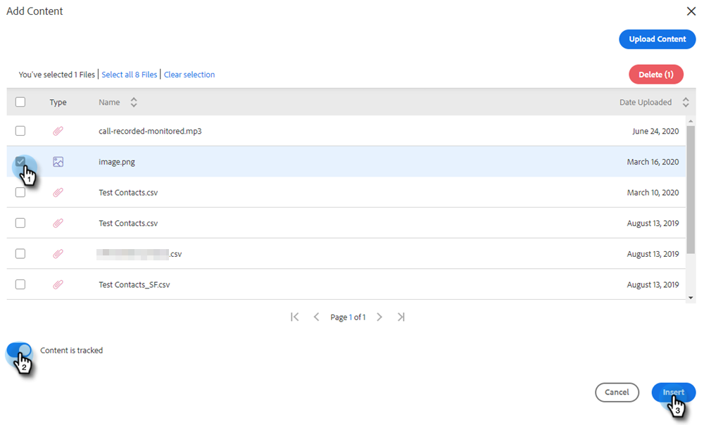

# Añadir un archivo adjunto o contenido rastreable al correo electrónico {#add-an-attachment-or-trackable-content-to-your-email}

Al enviar un correo electrónico a través de Marketo Sales, tiene la opción de agregar un archivo como archivo adjunto o hacer que un archivo sea un vínculo descargable (y rastreable).

>[!NOTE]
>
>Normalmente, cualquier archivo de más de 20 MB será demasiado grande para su entrega. El tamaño de un archivo adjunto que puede enviar por correo electrónico varía en función del canal de envío de correo electrónico que utilice.

## Añadir un archivo adjunto {#add-an-attachment}

1. Cree su borrador de correo electrónico (hay varias formas de hacerlo, en este ejemplo elegimos **Componer** en el encabezado).

   

1. Rellene el campo To e introduzca un Subject.

   

1. Haga clic en el icono de datos adjuntos.

   

1. Seleccione el archivo que desea adjuntar y haga clic en **Insertar**.

   

   >[!NOTE]
   >
   >Si necesita cargar un archivo, haga clic en el botón **Cargar contenido** en la parte superior derecha de la ventana.

   El archivo adjunto aparece en la parte inferior del correo electrónico.

   

## Añadir contenido rastreable {#add-trackable-content}

1. Cree su borrador de correo electrónico (hay varias formas de hacerlo, en este ejemplo elegimos la ventana Componer).

   

1. Rellene el campo To e introduzca un Subject.

   

1. Haga clic en el punto del correo electrónico en el que desea que aparezca el contenido rastreable y haga clic en el icono de datos adjuntos.

   

1. Seleccione el contenido que desea añadir y haga clic en el botón **Seguimiento del contenido** y haga clic en **Insertar**.

   

   >[!NOTE]
   >
   >Si necesita cargar un archivo, haga clic en el botón **Cargar contenido** en la parte superior derecha de la ventana.

   El contenido aparece como un vínculo en el correo electrónico. El destinatario puede hacer clic en el vínculo para descargar el contenido.

   

   >[!NOTE]
   >
   >Se notificará a los usuarios en la fuente activa cuando las personas vean su contenido rastreado. Los usuarios también pueden ver el contenido de mayor rendimiento en la sección de contenido de la página Analytics.

## Actualizaciones de contenido rastreables {#trackable-content-updates}

**Visor de contenido rastreable**

Cuando un posible cliente haga clic en contenido rastreable del correo electrónico, se abrirá un visor de contenido.

Dentro del visualizador de contenido, los posibles clientes pueden hacer lo siguiente.

* Descargar el documento

* Desplazar la página por el documento

* Ver la información de contacto del remitente

**Eventos de contenido rastreables en una fuente en directo**

Cuando un posible cliente haga clic en el vínculo de nuestro documento, verá un evento de clic. Puede hacer clic en ese vínculo para ver el contenido. Siempre que haya iniciado sesión en su cuenta de Acciones en el explorador, no contaremos estos clics como eventos.

Cada vez que el posible cliente avanza a otra página del documento, recibirá un evento Visto en la fuente activa que muestra el nombre del documento.
