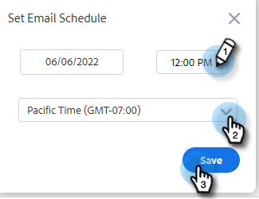

# Programación de correos electrónicos {#scheduling-an-email}

Siga estos sencillos pasos para programar un correo electrónico.

>[!NOTE]
>
>Para actualizar la zona horaria predeterminada, vaya a la página Configuración .

1. Cree su borrador de correo electrónico (hay varias formas de hacerlo, en este ejemplo elegimos **Componer** en el encabezado).

   

1. Cuando haya terminado de componer el correo electrónico, haga clic en **Programación** en la parte inferior derecha

   

1. Haga clic en la fecha para abrir el selector de fechas y seleccionar una fecha.

   

1. Escriba la hora a la que quiere que salga el correo electrónico. Seleccione la zona horaria que desee y haga clic en **Guardar**. Cierre el planificador cuando termine.

   

1. Ahora que la fecha y la hora programadas están seleccionadas, haga clic en **Enviar** para programar el correo electrónico.

   

   >[!NOTE]
   >
   >Los correos electrónicos programados se pueden ver o editar en la sección de carpetas programadas del Centro de comandos.

   >[!MORELIKETHIS]
   >
   >[Información general del centro de comandos](/help/marketo/product-docs/marketo-sales-insight/actions/email/command-center/command-center-overview.md)
