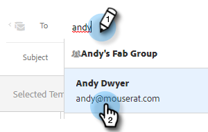

# Envío de un correo electrónico rastreado {#sending-a-tracked-email}

Al enviar un correo electrónico con Marketo Sales Connect, se realizará un seguimiento de las vistas (aperturas por correo electrónico) y los clics (vínculos en los que se hizo clic).

>[!PREREQUISITES]
>
>Deberá comprobar la identidad y configurar un canal de envío de correo electrónico antes de enviar un correo electrónico rastreado.
>
>* [Verifique su dirección de correo electrónico](/help/marketo/product-docs/marketo-sales-insight/actions/getting-started/email-settings/verify-your-email.md)
>* Configuración de un canal de envío para [Outlook](/help/marketo/product-docs/marketo-sales-connect/email-plugins/msc-for-outlook/email-connection-for-outlook-users.md) o [Gmail](/help/marketo/product-docs/marketo-sales-connect/email-plugins/gmail/email-connection-for-gmail-users.md)

1. Cree su borrador de correo electrónico (hay varias formas de hacerlo, en este ejemplo elegimos **Componer** en el encabezado).

   

1. Introduzca el nombre o el correo electrónico de un destinatario en la **Hasta** campo .

   

   >[!NOTE]
   >
   >Solo puede haber una persona en el campo Para.

1. Agregue cualquier destinatario que desee a CC o BCC en los campos respectivos.

   

   >[!NOTE]
   >
   >Si alguien que ha sido CC’d o BCC’d abre el correo electrónico, esa apertura se registrará como una vista en el registro de la persona en la **Hasta** campo .

1. Añada una línea de asunto.

   

   >[!NOTE]
   >
   >Se requiere una línea de asunto y un destinatario para enviar el correo electrónico. Nosotros **guardar automáticamente el borrador** una vez añadidos una línea de asunto y un destinatario.

1. Redacte el correo electrónico con el editor. Haga clic en **Enviar** (o [Programación](/help/marketo/product-docs/marketo-sales-connect/email/using-the-compose-window/scheduling-an-email.md), si lo prefiere) cuando haya terminado.

   

   >[!MORELIKETHIS]
   >
   >* [Programación de correos electrónicos](/help/marketo/product-docs/marketo-sales-insight/actions/email/using-the-compose-window/scheduling-an-email.md)
   >* [Plantillas](/help/marketo/product-docs/marketo-sales-insight/actions/templates/manage-templates.md#create-a-new-template)

