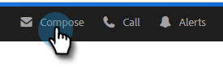
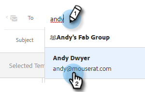
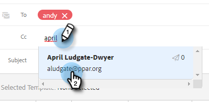
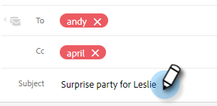
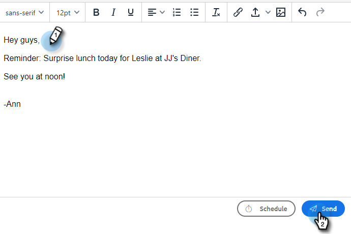

# Enviar un correo electrónico rastreado {#sending-a-tracked-email}

Al enviar un correo electrónico con Marketo Sales Connect, se realiza un seguimiento de las vistas (aperturas de correo electrónico) y los clics (vínculos en los que se ha hecho clic).

>[!PREREQUISITES]
>
>Debe tener una identidad verificada y un canal de envío de correo electrónico configurado antes de enviar un correo electrónico rastreado.
>
>* [Verifique su dirección de correo electrónico](/help/marketo/product-docs/marketo-sales-insight/actions/getting-started/email-settings/verify-your-email.md)
>* Configurar un canal de entrega para [Outlook](/help/marketo/product-docs/marketo-sales-connect/email-plugins/msc-for-outlook/email-connection-for-outlook-users.md) o [Gmail](/help/marketo/product-docs/marketo-sales-connect/email-plugins/gmail/email-connection-for-gmail-users.md)

1. Cree su borrador de correo electrónico (existen varias formas de hacerlo; en este ejemplo, elegimos **Componer** en el encabezado).

   

1. Escriba el nombre o el correo electrónico de un destinatario en el campo **Para**.

   

   >[!NOTE]
   >
   >Solo se puede tener una persona en el campo Para.

1. Añada cualquier destinatario que desee copiar o copiar en los campos respectivos.

   

   >[!NOTE]
   >
   >Si alguien que ha sido CC o CCO abre el correo electrónico, esa apertura se registrará como una vista en el registro de la persona en el campo **Para**.

1. Añada una línea de asunto.

   

   >[!NOTE]
   >
   >Se requiere una línea de asunto y un destinatario para enviar el correo electrónico. **guardaremos automáticamente su borrador** una vez que se hayan agregado la línea de asunto y el destinatario.

1. Componga el correo electrónico con el editor. Haga clic en **Enviar** (o en [Programar](/help/marketo/product-docs/marketo-sales-connect/email/using-the-compose-window/scheduling-an-email.md), si lo prefiere) cuando haya terminado.

   

   >[!MORELIKETHIS]
   >
   >* [Programando un correo electrónico](/help/marketo/product-docs/marketo-sales-insight/actions/email/using-the-compose-window/scheduling-an-email.md)
   >* [Plantillas](/help/marketo/product-docs/marketo-sales-insight/actions/templates/manage-templates.md#create-a-new-template)
