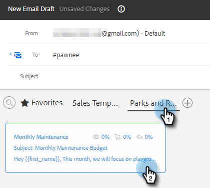
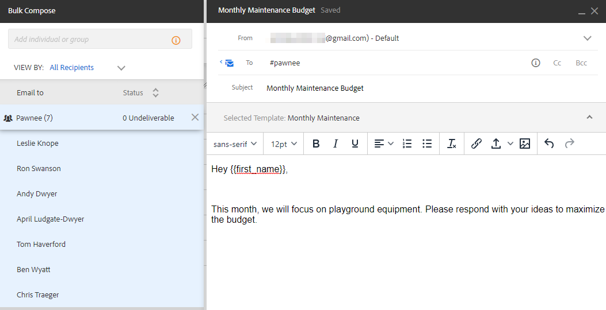

# Envío de correos electrónicos a través del correo electrónico del grupo {#sending-emails-via-group-email}

A continuación se muestra cómo enviar o editar correos electrónicos mediante la opción Correo electrónico del grupo .

## Envío de un correo electrónico de grupo {#sending-a-group-email}

1. Haga clic en el **People** pestaña .

   

1. Seleccione el grupo al que desee enviar el correo electrónico.

   

1. Haga clic en el botón Acciones de grupo y seleccione **Grupo de correo electrónico**.

   

1. Rellene el correo electrónico (o seleccione una plantilla) y envíelo (o programe).

   

## Edición de un correo electrónico de grupo {#editing-a-group-email}

1. Crear un correo electrónico de grupo mediante [Pasos 1 a 3 anteriores](#sending-a-group-email).

1. [Elegir una plantilla](/help/marketo/product-docs/marketo-sales-insight/actions/email/using-the-compose-window/using-a-template-in-the-compose-window.md)o rellene el correo electrónico.

   

1. Una vez finalizado el correo electrónico, ahora puede obtener una vista previa de cada correo electrónico de la lista para ver si los campos dinámicos se rellenan correctamente.

   

1. Seleccione el destinatario deseado y haga clic en **Vista previa de campos dinámicos**. Vea la vista previa a la derecha.

   

   >[!NOTE]
   >
   >Puede realizar ediciones masivas en el correo electrónico o la plantilla al enviar un correo electrónico de grupo, pero no puede realizar ediciones únicas para destinatarios específicos en la lista.

>[!MORELIKETHIS]
>
>* [Opciones de envío masivo](/help/marketo/product-docs/marketo-sales-insight/actions/email/using-the-compose-window/bulk-emailing-options.md)
>* [Uso de una plantilla en la ventana de composición](/help/marketo/product-docs/marketo-sales-insight/actions/email/using-the-compose-window/using-a-template-in-the-compose-window.md)

