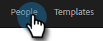
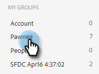
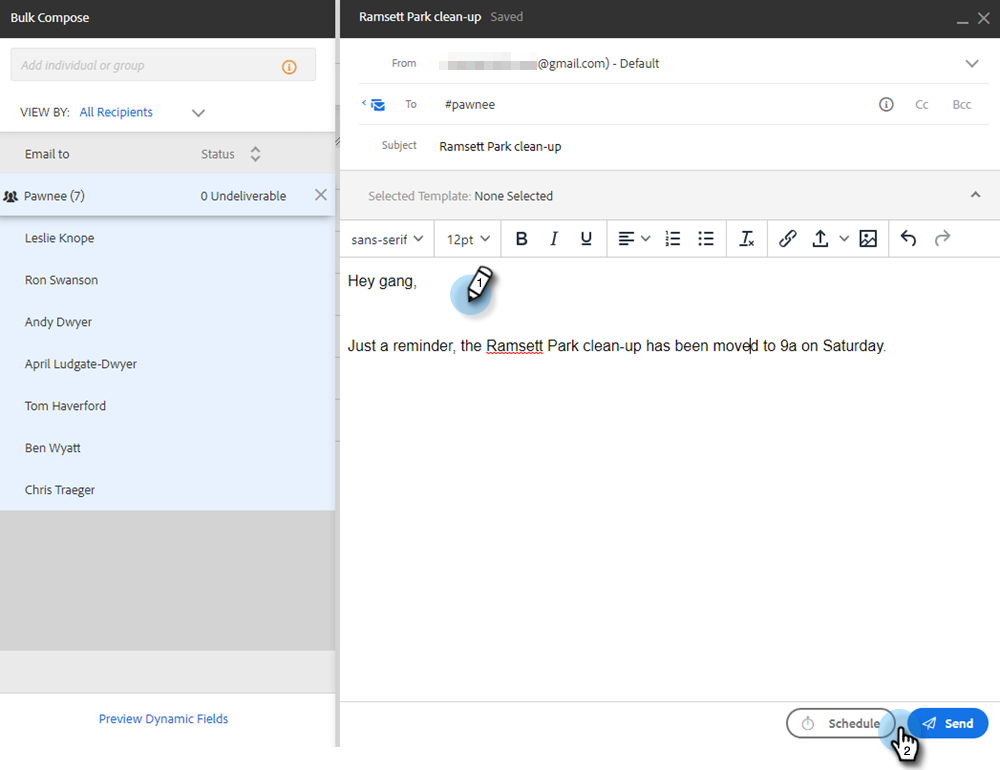
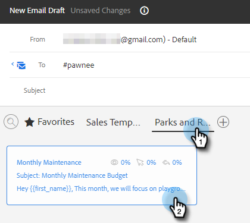
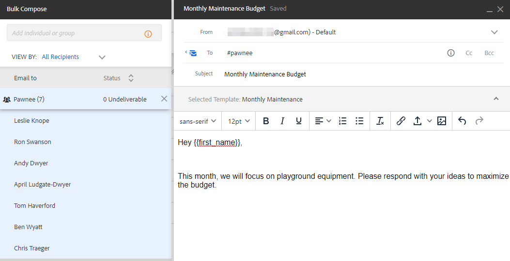

# Enviar correos electrónicos mediante correo electrónico de grupo {#sending-emails-via-group-email}

A continuación, se muestra cómo enviar/editar correos electrónicos con la opción Agrupar correo electrónico.

## Envío de correo electrónico de grupo {#sending-a-group-email}

1. Haga clic en la pestaña **[!UICONTROL Personas]**.

   

1. Seleccione el grupo al que desee enviar el correo electrónico.

   

1. Haga clic en el botón [!UICONTROL Acciones de grupo] y seleccione **[!UICONTROL Grupo de correo electrónico]**.

   

1. Complete su correo electrónico (o seleccione una plantilla) y envíelo (o programe).

   

## Edición de un correo electrónico de grupo {#editing-a-group-email}

1. Cree un correo electrónico de grupo mediante [Pasos del 1 al 3 anteriores](#sending-a-group-email).

1. [Elige una plantilla](/help/marketo/product-docs/marketo-sales-insight/actions/email/using-the-compose-window/using-a-template-in-the-compose-window.md) o completa tu correo electrónico.

   

1. Una vez completado el correo electrónico, ahora puede obtener una vista previa de cada correo electrónico en la lista para ver si los campos dinámicos se rellenan correctamente.

   

1. Seleccione el destinatario deseado y haga clic en **[!UICONTROL Vista previa de campos dinámicos]**. Vea la vista previa a la derecha.

   

   >[!NOTE]
   >
   >Puede realizar ediciones masivas en el correo electrónico o la plantilla al enviar un correo electrónico de grupo, pero no puede realizar ediciones únicas para destinatarios específicos de la lista.

>[!MORELIKETHIS]
>
>* [Opciones de envío masivo](/help/marketo/product-docs/marketo-sales-insight/actions/email/using-the-compose-window/bulk-emailing-options.md)
>* [Uso de una plantilla en la ventana de composición](/help/marketo/product-docs/marketo-sales-insight/actions/email/using-the-compose-window/using-a-template-in-the-compose-window.md)
