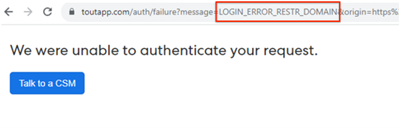
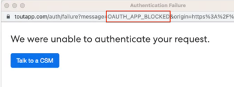

# ¿Cómo soluciono &quot;No pudimos autenticar su solicitud&quot; al conectar con [!DNL Salesforce]? {#how-do-i-fix-we-were-unable-to-authenticate-your-request-when-connecting-to-salesforce}

Si intenta conectar la instancia de Marketo Sales a Salesforce y aparece el error &quot;No podemos autenticar la solicitud&quot;, probablemente esté relacionado con la configuración de la instancia de Salesforce.

Existen dos tipos de errores que podrían estar produciendo esta página de autenticación fallida.

* Error de inicio de sesión restringido Dominio
* Aplicación Oauth bloqueada

Puede identificar qué tipo de datos está obteniendo comprobando la dirección URL.

## Resolver dominio restringido de error de inicio de sesión {#resolve-login-error-restricted-domain}

Este error suele indicar que tiene un dominio personalizado al que no podemos enrutar. Para resolver este error, intente iniciar sesión en la instancia de Salesforce a la que desee conectarse primero. A continuación, siga los pasos para conectarse a Salesforce.

Si la instancia a la que intenta conectarse es un dominio de zona protegida de Salesforce y aparece un error, deberá seguir pasos adicionales para actualizar la instancia y que sea compatible con la zona protegida de Salesforce. [Más información](/help/marketo/product-docs/marketo-sales-insight/actions/crm/salesforce-integration/set-up-a-sales-insight-actions-sandbox.md){target="_blank"}.

## Resolver aplicación Oauth bloqueada {#resolve-oauth-app-blocked}

Si ha recibido el mensaje de error &quot;No hemos podido autenticar su solicitud&quot; con el tipo de error OAuth App Blocked (u otro tipo) en la dirección URL, puede que haya una restricción en su acceso a la API de Salesforce. Consulte con su administrador de Salesforce para asegurarse de que todo lo que se muestra a continuación esté bien.

### Habilitar API en permisos de usuario {#enable-api-in-user-permissions}

1. Haga que un administrador de Salesforce inicie sesión en Salesforce.
1. Seleccione **Configuración**.
1. Seleccione **Administrar usuarios**.
1. Seleccione **Perfiles**.
1. Busque el perfil en el que se encuentran los usuarios de ToutApp y haga clic en **Editar**.
1. Desplácese hacia abajo hasta **Permisos administrativos** y asegúrese de que la **API habilitada** esté seleccionada.

### Comprobar si Salesforce bloquea la conexión de las acciones de Insight de ventas {#check-if-salesforce-is-blocking-sales-insight-actions-from-connecting}

1. Haga que un administrador de Salesforce inicie sesión en Salesforce.
1. Seleccione **Configuración**.
1. Seleccione **Administrar aplicaciones**.
1. Seleccione **Uso de OAuth para aplicaciones conectadas**.
1. Asegúrese de que Acciones de Insight de ventas muestra &quot;Bloquear&quot; junto a ella. Si ve &quot;Desbloquear&quot;, haga clic en el botón para desbloquear el acceso de las acciones de Sales Insight a Salesforce.
