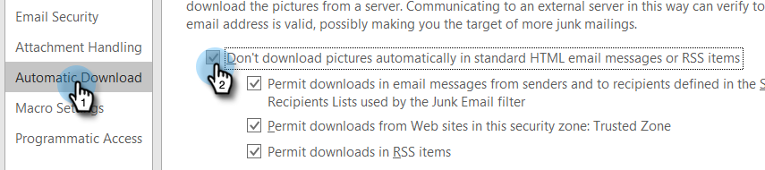

# ¿Cómo evito las auto-visualizaciones? {#how-do-i-prevent-self-views}

Obtener falsos positivos en el seguimiento de vistas puede provocar incoherencias en los informes. Esto suele ocurrir cuando los usuarios de [!DNL Marketo Sales] invocan accidentalmente el píxel de seguimiento desde su cliente de correo electrónico (lo llamamos vista propia). A continuación se ofrecen algunas sugerencias para reducir significativamente e incluso eliminar las visualizaciones automáticas.

## Web ([!DNL Outlook] aplicación web y Gmail) {#web-outlook-web-app-and-gmail}

[!DNL Marketo Sales] almacenará una cookie en su explorador para evitar que se rastreen las vistas al abrir sus correos electrónicos desde [!DNL Outlook] Web App y Gmail. Si sigue recibiendo autovisualizaciones, le recomendamos que haga lo siguiente:

* Asegúrese de que tiene las cookies habilitadas en el equipo.

* Si utiliza un equipo nuevo o un dispositivo móvil, asegúrese de haber iniciado sesión en la aplicación web. Esto nos permitirá reconocer su ordenador/dispositivo a partir de ahora.

## Escritorio (Windows) {#desktop-windows}

Las vistas se rastrean descargando un pequeño píxel de imagen invisible en su cliente de correo electrónico. Puede reducir significativamente la cantidad de visualizaciones automáticas en [!DNL Outlook] si deshabilita las imágenes para que se descarguen automáticamente. A continuación se muestran los pasos para hacerlo.

1. En Outlook, haga clic en **[!UICONTROL Archivo]** en la barra de menús.

   

1. Haga clic en **[!UICONTROL Opciones]**.

   

1. En el cuadro de diálogo Opciones de [!DNL Outlook], haga clic en **[!UICONTROL Centro de confianza]**.

   

1. En el Centro de confianza de Microsoft [!DNL Outlook], haga clic en **[!UICONTROL Configuración del Centro de confianza]**.

   

1. Haga clic en [!UICONTROL Descarga automática] en el menú de la izquierda y active la casilla de verificación **[!UICONTROL No descargar imágenes automáticamente en elementos de correo electrónico o RSS de HTML]**.

   

1. Haga clic en **[!UICONTROL Aceptar]** en el cuadro de diálogo [!UICONTROL Centro de confianza].

   

1. Haga clic en **[!UICONTROL Aceptar]** en el cuadro de diálogo Opciones de [!DNL Outlook].

   

## Escritorio (Mac) {#desktop-mac}

Las vistas se rastrean descargando un pequeño píxel de imagen invisible en su cliente de correo electrónico. Puede reducir significativamente la cantidad de visualizaciones automáticas en [!DNL Outlook] si deshabilita las imágenes para que se descarguen automáticamente. A continuación se muestran los pasos para hacerlo.

1. En [!DNL Outlook], haga clic en **[!UICONTROL Outlook]** en la barra de menús y seleccione **[!UICONTROL Preferencias]**.

   

1. En [!UICONTROL Correo electrónico], elija **[!UICONTROL Leyendo]**.

   

1. En [!UICONTROL Seguridad], haga clic en el botón de opción **[!UICONTROL Nunca]**.

   
