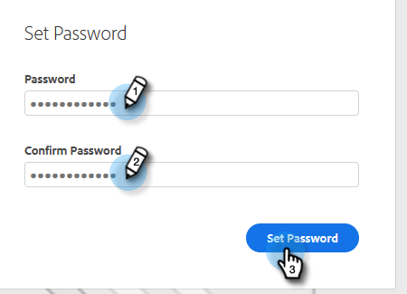

# Cambiar la contraseña de ventas de Marketo {#change-your-marketo-sales-password}

¿Necesita cambiar su contraseña? Así es como.

## Cambiar la contraseña al iniciar sesión {#change-your-password-while-signed-in}

1. Haga clic en el icono del engranaje y seleccione **Configuración**.

   

1. La página Mi perfil se abre de forma predeterminada. En Detalles de la cuenta, seleccione la **Cambiar contraseña** casilla de verificación.

   

1. Escriba la contraseña actual. A continuación, introduzca el nuevo y vuelva a escribirlo para asegurarse de que coinciden. Haga clic en **Guardar** cuando haya terminado.

   

>[!NOTE]
>
>Las contraseñas deben:
>
>* Incluir al menos nueve caracteres
>* Utilice mayúsculas y minúsculas mixtas (tanto superior como inferior)
>* Incluir un número
>* Incluir un carácter especial

## Cambiar la contraseña al cerrar la sesión {#change-your-password-while-signed-out}

1. Vaya a la [Inicio de sesión de Conexión de ventas](https://toutapp.com/login) página. Introduzca su dirección de correo electrónico y haga clic en **Inicio de sesión**.

   

1. Haga clic en **Contraseña olvidada**.

   

1. Introduzca la dirección de correo electrónico asociada a la cuenta y haga clic en **Enviar correo electrónico de restablecimiento**.

   

1. Enviaremos un correo electrónico para verificar que el propietario de la cuenta desea cambiar la contraseña. Haga clic en **Restablecer contraseña**.

   

   >[!NOTE]
   >
   >Asegúrese de comprobar también su carpeta de correo no deseado, ya que este correo electrónico a veces puede terminar allí.

1. Escriba y confirme la nueva contraseña. Haga clic en **Establecer contraseña** cuando haya terminado.

   
