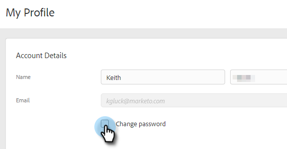

# Cambiar la contraseña de ventas de Marketo {#change-your-marketo-sales-password}

¿Necesita cambiar la contraseña? Así es cómo se hace.

## Cambiar La Contraseña Al Iniciar Sesión {#change-your-password-while-signed-in}

1. Haga clic en el icono del engranaje y seleccione **[!UICONTROL Configuración]**.

   

1. Se abre la página [!UICONTROL Mi perfil] de forma predeterminada. En [!UICONTROL Detalles de la cuenta], active la casilla de verificación **[!UICONTROL Cambiar contraseña]**.

   

1. Introduzca la contraseña actual. A continuación, introduzca el nuevo y vuelva a escribirlo para asegurarse de que coincida. Haga clic en **[!UICONTROL Guardar]** cuando termine.

   

>[!NOTE]
>
>Las contraseñas deben:
>
>* Incluir al menos nueve caracteres
>* Usar mayúsculas y minúsculas mixtas (tanto superiores como inferiores)
>* Incluir un número
>* Incluir un carácter especial

## Cambiar la contraseña mientras se cierra la sesión {#change-your-password-while-signed-out}

1. Vaya a la página de inicio de sesión de [Sales Connect](https://toutapp.com/login). Escriba su dirección de correo electrónico y haga clic en **[!UICONTROL Iniciar sesión]**.

   

1. Haga clic en **[!UICONTROL Contraseña olvidada]**.

   

1. Escriba la dirección de correo electrónico asociada con la cuenta y haga clic en **[!UICONTROL Enviar correo electrónico para restablecer]**.

   

1. Enviaremos un correo electrónico para verificar que el propietario de la cuenta desea cambiar la contraseña. Haga clic en **[!UICONTROL Restablecer contraseña]**.

   

   >[!NOTE]
   >
   >Asegúrese de comprobar también la carpeta de correo no deseado, ya que este correo electrónico a veces puede acabar allí.

1. Introduzca y confirme la nueva contraseña. Haga clic en **[!UICONTROL Establecer contraseña]** cuando haya terminado.

   
