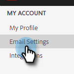

# Añadir o actualizar la firma de correo electrónico {#add-or-update-your-email-signature}

Queremos que el envío por correo electrónico desde Marketo Sales se sienta como una experiencia perfecta cuando se envía desde su propio cliente de correo electrónico. Una buena manera de hacerlo es agregar su firma de correo electrónico.

1. Haga clic en el icono del engranaje y seleccione **Configuración**.

   

1. En Mi cuenta, seleccione **Configuración de correo electrónico**.

   

1. En el **Dirección y firma** , seleccione la identidad de correo electrónico para la que desea crear una firma.

   

1. En la tarjeta de firma, haga clic en **Editar**.

   

1. Introduzca el texto (o imágenes) deseado y haga clic en **Guardar**.

   

   >[!TIP]
   >
   >Asegúrese de que la firma en la pantalla de composición tenga un aspecto similar a la firma enumerada en el cliente de correo electrónico.
