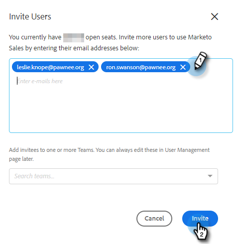
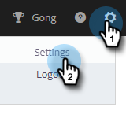
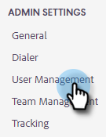

# Guía de administración de las acciones de perspectiva de ventas {#sales-insight-actions-admin-guide}

>[!PREREQUISITES]
>
>* Confirme con el gestor de éxito del cliente que las acciones MSI se han habilitado para su cuenta de Marketo (si no tiene un CSM, [póngase en contacto con el servicio de asistencia de Marketo](https://nation.marketo.com/t5/support/ct-p/Support)).
>* Se debe configurar la sincronización de Marketo/Salesforce.

<table>
 <tr>
  <th>Persona</th>
  <th>Paso</th>
 </tr>
 <tr>
  <td>Administrador de Marketo</td>
  <td>Configurar cuenta de ventas de Marketo</td>
 </tr>
 <tr>
  <td>Administrador de Marketo o  Administrador de Salesforce</td>
  <td>Conectar la cuenta de ventas de Marketo con Salesforce</td>
 </tr>
 <tr>
  <td>Administrador de Marketo</td>
  <td>Conectar la cuenta de ventas de Marketo a Marketo</td>
 </tr>
 <tr>
  <td>Administrador de Marketo</td>
  <td>Iniciar la sincronización de datos de la cuenta de ventas de Marketo a Marketo</td>
 </tr>
 <tr>
  <td>Administrador de Marketo</td>
  <td>Invitar usuarios a MSI-Actions</td>
 </tr>
 <tr>
  <td>Administrador de Salesforce</td>
  <td>Instalación/actualización del paquete MSI en Salesforce</td>
 </tr>
 <tr>
  <td>Administrador de Salesforce</td>
  <td>Configurar MSI-Actions en Salesforce</td>
 </tr>
</table>

## Configurar cuenta de ventas de Marketo {#set-up-marketo-sales-account}

1. En Marketo, haga clic en **Administrador**.

   

1. Haga clic en **Perspectiva de ventas**, luego **Configuración de acciones**. Seleccione entre una lista de administradores de Marketo para invitar y haga clic en **Enviar invitación**.

   

El usuario recibirá un correo electrónico con los pasos para obtener acceso a la cuenta.

>[!NOTE]
>
>Los usuarios adicionales no se agregarán a través de Marketo y, en su lugar, se agregarán a través de la página Administración de usuarios de cuentas de ventas . [Haga clic aquí](/help/marketo/product-docs/marketo-sales-connect/admin/invite-users.md) para obtener más información sobre la adición de usuarios adicionales.

## Conectar la cuenta de ventas de Marketo con Salesforce {#connect-marketo-sales-account-to-salesforce}

1. En la cuenta de ventas de Marketo, haga clic en el icono del engranaje y seleccione **Configuración**.

   

1. En Configuración de administración, haga clic en **Salesforce**.

   

1. En la pestaña Conexiones y personalizaciones , haga clic en **Connect**.

   

1. Haga clic en **OK**.

   

Si ya ha iniciado sesión en Salesforce, estará conectado. Si no lo está, se le pedirá que inicie sesión.

## Conectar Marketo a su cuenta de aplicaciones de ventas {#connect-marketo-to-your-sales-apps-account}

1. En la cuenta de ventas de Marketo, haga clic en el icono del engranaje y seleccione **Configuración**.

   

1. En Configuración de administración, haga clic en **Marketo**.

   

1. Haga clic en **connect**. La cuenta se conectará.

   

>[!NOTE]
>
>Si no se conecta, copie las credenciales de la pestaña &quot;Configuración de acciones&quot; de Marketo Sales Insight y péguelas en la pestaña Configurar .

## Iniciar sincronización de datos {#initiate-data-sync}

La sincronización de campos de unificación de datos para acciones de perspectiva de ventas permite al sistema extraer información de las personas de la base de datos de Marketo Engage a la base de datos de acciones de perspectiva de ventas, mantener los datos de las personas actualizados y garantizar que las actividades se registren en los registros adecuados en Marketo y Salesforce.

1. En Marketo, haga clic en **Administrador**.

   

1. Haga clic en **Perspectiva de ventas**.

   

1. Haga clic en el **Configuración de acciones** pestaña . En la tarjeta de sincronización de campos de acción, haga clic en **Sincronización**.

   

1. Verá una vista previa de los campos que se sincronizarán. Haga clic en **Iniciar sincronización**.

   

Los registros de personas que existen en Marketo y Salesforce se sincronizarán con la cuenta de las aplicaciones de ventas de Marketo.

>[!NOTE]
>
>Para obtener más información sobre cómo se sincronizan los datos de personas y actividades entre las acciones de perspectiva de ventas, Marketo y Salesforce, [haga clic aquí](/help/marketo/product-docs/marketo-sales-insight/actions/admin/actions-data-sync-faq.md).

## Invitar usuarios individuales a acciones MSI {#invite-individual-users-to-msi-actions}

1. En la cuenta de ventas de Marketo, haga clic en el icono del engranaje y seleccione **Configuración**.

   

1. En Configuración de administración, seleccione **Administración de usuarios**.

   

1. Haga clic en **Acciones** y seleccione **Invitar usuarios**.

   

1. Introduzca las direcciones de correo electrónico y haga clic en **Invitar**.

   

>[!NOTE]
>
>De forma predeterminada, todos los miembros nuevos se agregarán al equipo Todos .

Recibirá un mensaje de confirmación.

## Invitar usuarios mediante CSV a acciones MSI {#invite-users-via-csv-to-msi-actions}

1. En la cuenta de ventas de Marketo, haga clic en el icono del engranaje y seleccione **Configuración**.

   

1. En Configuración de administración, seleccione **Administración de usuarios**.

   

1. Haga clic en **Acciones** y seleccione **Invitar usuarios a través de CSV**.

   

1. Busque el CSV en el equipo, selecciónelo y haga clic en **Siguiente**.

   

1. Confirme que los campos están asignados correctamente y haga clic en **Invitar**.

   

Recibirá un mensaje de confirmación una vez que se envíen las invitaciones.

>[!NOTE]
>
>Una vez hecho esto, puede actualizar su paquete MSI existente o instalar uno nuevo y pasar a [configuración de acciones MSI en Salesforce](/help/marketo/product-docs/marketo-sales-insight/actions/salesforce-configuration/sales-insight-actions-configuration-in-salesforce.md).
