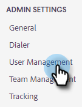

# Guía de configuración de administración de acciones de Sales Insight {#sales-insight-actions-admin-setup-guide}

>[!NOTE]
>
>Marketo Sales Insight Actions es una aplicación basada en web que se integra con la interfaz de usuario de Salesforce a través de la [Paquete de perspectivas de ventas de Marketo](/help/marketo/product-docs/marketo-sales-insight/msi-for-salesforce/installation/install-marketo-sales-insight-package-in-salesforce-appexchange.md){target="_blank"}. A veces se denomina &quot;Ventas Marketo&quot; o simplemente &quot;Acciones&quot;.

>[!PREREQUISITES]
>
>* Confirme con el equipo de cuenta de Adobe (su administrador de cuentas) que las acciones MSI se han habilitado para su cuenta de Marketo Engage (si no tiene un administrador de cuentas, póngase en contacto con [Asistencia de Marketo](https://nation.marketo.com/t5/support/ct-p/Support){target="_blank"}).
>* Se debe configurar la sincronización de Marketo/Salesforce.

<table>
 <tr>
  <th>Persona</th>
  <th>Paso</th>
 </tr>
 <tr>
  <td>Administrador de Marketo</td>
  <td>Configurar la cuenta de ventas de Marketo</td>
 </tr>
 <tr>
  <td>Administrador de Marketo o  Administrador de Salesforce</td>
  <td>Conectar la cuenta de ventas de Marketo a Salesforce</td>
 </tr>
 <tr>
  <td>Administrador de Marketo</td>
  <td>Conectar la cuenta de ventas de Marketo a Marketo</td>
 </tr>
 <tr>
  <td>Administrador de Marketo</td>
  <td>Iniciar sincronización de datos de Marketo a la cuenta de ventas de Marketo</td>
 </tr>
 <tr>
  <td>Administrador de Marketo</td>
  <td>Invitar a usuarios a MSI-Actions</td>
 </tr>
 <tr>
  <td>Administrador de Salesforce</td>
  <td>Instalación/actualización del paquete MSI en Salesforce</td>
 </tr>
 <tr>
  <td>Administrador de Salesforce</td>
  <td>Configurar acciones MSI en Salesforce</td>
 </tr>
</table>

## Configurar la cuenta de ventas de Marketo {#set-up-marketo-sales-account}

1. En Marketo, haga clic en **Administrador**.

   

1. Clic **Perspectiva de ventas**, entonces **Configuración de acciones**. Seleccione de una lista de administradores de Marketo para invitar y haga clic en **Enviar invitación**.

   

El usuario recibirá un correo electrónico con los pasos para obtener acceso a la cuenta.

>[!NOTE]
>
>Los usuarios adicionales no se añadirán a través de Marketo y, en su lugar, se añadirán a través de la página de Administración de usuarios de la cuenta de ventas. [Haga clic aquí](/help/marketo/product-docs/marketo-sales-connect/admin/invite-users.md){target="_blank"} para obtener más información sobre cómo agregar usuarios adicionales.

## Conectar la cuenta de ventas de Marketo a Salesforce {#connect-marketo-sales-account-to-salesforce}

1. En su cuenta de ventas de Marketo, haga clic en el icono de engranaje y seleccione **Configuración**.

   

1. En Configuración de administración, haga clic en **Salesforce**.

   

1. En la pestaña Conexiones y personalizaciones, haga clic en **Connect**.

   

1. Clic **OK**.

   

Si ya ha iniciado sesión en Salesforce, estará conectado. Si no lo está, se le pedirá que inicie sesión.

## Conectar Marketo a su cuenta de aplicaciones de ventas {#connect-marketo-to-your-sales-apps-account}

1. En su cuenta de ventas de Marketo, haga clic en el icono de engranaje y seleccione **Configuración**.

   

1. En Configuración de administración, haga clic en **Marketo**.

   

1. Clic **conectar**. La cuenta se conectará a continuación.

   

>[!NOTE]
>
>Si no se conecta, copie las credenciales de la pestaña &quot;Configuración de acciones&quot; de Marketo Sales Insight y péguelas en la pestaña Configuración.

## Iniciar sincronización de datos {#initiate-data-sync}

La sincronización de campos de unificación de datos para las acciones de información de ventas permite al sistema extraer información de la persona de la base de datos de Marketo Engage a la base de datos de acciones de información de ventas, mantener los datos de las personas actualizados y garantizar que las actividades se registren en los registros correctos en Marketo y Salesforce.

>[!CAUTION]
>
>Una vez iniciada la sincronización de datos, debería **no** elimine el usuario original de la instancia de acciones de información de ventas. Este es el usuario al que se envió la primera invitación.

1. En Marketo, haga clic en **Administrador**.

   

1. Clic **Perspectiva de ventas**.

   

1. Haga clic en **Configuración de acciones** pestaña. En la tarjeta Sincronizar campos de acción, haga clic en **Sincronización**.

   

1. Verá una vista previa de los campos que se sincronizarán. Clic **Iniciar sincronización**.

   

Los registros de persona que existen en Marketo y Salesforce se sincronizarán con su cuenta de Marketo Sales Apps.

>[!NOTE]
>
>Para obtener más información sobre cómo los datos de personas y actividades se sincronizan entre las acciones de Sales Insight, Marketo y Salesforce, [haga clic aquí](/help/marketo/product-docs/marketo-sales-insight/actions/admin/sync-sales-action-data-with-marketo-and-salesforce.md){target="_blank"}.

## Invitar usuarios individuales a acciones de MSI {#invite-individual-users-to-msi-actions}

1. En su cuenta de ventas de Marketo, haga clic en el icono de engranaje y seleccione **Configuración**.

   

1. En Configuración de administración, seleccione **Administración de usuarios**.

   

1. Clic **Acciones** y seleccione **Invitar a usuarios**.

   

1. Introduzca las direcciones de correo electrónico y haga clic en **Invitar**.

   

>[!NOTE]
>
>De forma predeterminada, todos los miembros nuevos se agregarán al equipo Todos.

Recibirá un mensaje de confirmación.

## Invitar a usuarios mediante CSV a acciones MSI {#invite-users-via-csv-to-msi-actions}

1. En su cuenta de ventas de Marketo, haga clic en el icono de engranaje y seleccione **Configuración**.

   

1. En Configuración de administración, seleccione **Administración de usuarios**.

   

1. Clic **Acciones** y seleccione **Invitar usuarios a través de CSV**.

   

1. Busque el CSV en el equipo, selecciónelo y haga clic en **Siguiente**.

   

1. Confirme que los campos están asignados correctamente y haga clic en **Invitar**.

   

Recibirás un mensaje de confirmación una vez que se envíen las invitaciones.

>[!NOTE]
>
>Una vez hecho esto, puede actualizar el paquete MSI existente o instalar uno nuevo y pasar a [configurar acciones MSI en Salesforce](/help/marketo/product-docs/marketo-sales-insight/actions/crm/salesforce-configuration/sales-insight-actions-configuration-in-salesforce.md){target="_blank"}.
