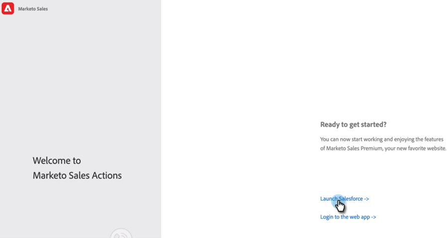

# Guía de incorporación del usuario de acciones de Sales Insight {#sales-insight-actions-user-onboarding-guide}

>[!NOTE]
>
>Marketo Sales Insight Actions es una aplicación basada en web que se integra exclusivamente con Salesforce CRM mediante el [paquete de Marketo Sales Insight](/help/marketo/product-docs/marketo-sales-insight/msi-for-salesforce/installation/install-marketo-sales-insight-package-in-salesforce-appexchange.md){target="_blank"}. A veces se denomina &quot;Ventas Marketo&quot; o simplemente &quot;Acciones&quot;.

>[!PREREQUISITES]
>
>* Un administrador debe invitar a un usuario a empezar a utilizar MSI-Actions.
>* Para activar su cuenta con Salesforce, necesitará tener &quot;API habilitada&quot; en los permisos de perfil de Salesforce.

Los nuevos usuarios deberán seguir los pasos a continuación.

1. En el correo electrónico de bienvenida, haga clic en **Comenzar**.

   

1. Haga clic en **Activar cuenta con Salesforce**.

   

1. Si ya ha iniciado sesión en su cuenta de Salesforce, se le dirigirá automáticamente a la siguiente pantalla. Si no ha iniciado sesión, hágalo ahora.

   

>[!NOTE]
>
>El ID del correo electrónico de Salesforce y el ID del correo electrónico de la cuenta de ventas deben ser iguales.

1. Haga clic en **Permitir**.

   

1. Haga clic en **Iniciar**.

   

1. Haga clic en **Siguiente**.

   

1. Elige el cliente de correo electrónico que uses (Gmail o Outlook) y haz clic en **Siguiente**.

   

1. Escriba su dirección de correo electrónico y haga clic en **Siguiente**.

   

1. Escriba su contraseña y haga clic en **Siguiente**.

   

1. Haga clic en **Continuar**.

   

>[!NOTE]
>
>Si elige Outlook, verá una pantalla de autenticación de Outlook donde escribirá su dirección de correo electrónico.

1. Verá el mensaje de configuración correcta de la conexión de correo electrónico y se le enviará a la pantalla siguiente.

   

1. Escriba su firma personalizada y haga clic en **Guardar** (si desea hacerlo más adelante a través de la página de perfil, haga clic en **Omitir**).

   

1. Haga clic en **Finalizar**.

   

1. Verá la opción para ver una introducción rápida a Marketo Sales Actions. Haga clic en **Siguiente** para ver o en **No ahora** para guardar para más tarde.

   

1. Cuando haya terminado el recorrido o, si se ha saltado, elija si desea iniciar sesión directamente en la aplicación web o en su cuenta de Salesforce, donde podrá acceder a todas las funciones desde el panel MSI (en este ejemplo, elegimos **Launch Salesforce**).

   

1. Dentro de Salesforce (Classic o Lightning), puede navegar a cualquier posible cliente, contacto, cuenta u oportunidad. Todas las acciones de ventas estarán disponibles a través de la lista desplegable del panel MSI.

   
