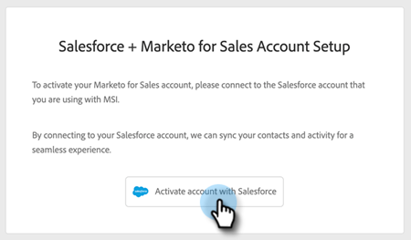

# Guía de incorporación del usuario de Sales Insight Actions {#sales-insight-actions-user-onboarding-guide}

>[!PREREQUISITES]
>
>* Un administrador debe invitar a un usuario para que empiece a usar MSI-Actions.
>* Para activar su cuenta con Salesforce, deberá tener &quot;API habilitada&quot; en los permisos de perfil de Salesforce.

Los nuevos usuarios deberán seguir los pasos a continuación.

1. En el correo electrónico de bienvenida, haga clic en **Introducción**.

   

1. Haga clic en **Activar cuenta con Salesforce**.

   

1. Si ya ha iniciado sesión en su cuenta de Salesforce, se le dirigirá automáticamente a la siguiente pantalla. Si no ha iniciado sesión, hágalo ahora.

   

>[!NOTE]
>
>El id. de correo electrónico y el id. de correo electrónico de la cuenta de ventas deben ser los mismos.

1. Haga clic en **Permitir**.

   

1. Haga clic en **Inicio**.

   

1. Haga clic en **Siguiente**.

   

1. Seleccione el cliente de correo electrónico que utiliza (Gmail o Outlook) y haga clic en **Siguiente**.

   

1. Introduzca su dirección de correo electrónico y haga clic en **Siguiente**.

   

1. Escriba la contraseña y haga clic en **Siguiente**.

   

1. Haga clic en **Continuar**.

   

>[!NOTE]
>
>Si elige Outlook, verá una pantalla Autenticación de Outlook en la que introducirá su dirección de correo electrónico.

1. Verá el mensaje de éxito Configurar conexión de correo electrónico y, a continuación, se le enviará a la siguiente pantalla.

   

1. Introduzca su firma personalizada y haga clic en **Guardar** (si desea hacerlo más adelante a través de la página de perfil, haga clic en **Omitir**).

   

1. Haga clic en **Finalizar**.

   

1. Verá la opción para ver una introducción rápida a las acciones de ventas de Marketo. Haga clic en **Siguiente** para ver, o **No ahora** para guardar posteriormente.

   

1. Cuando haya terminado con la visita, o si lo ha omitido, elija si iniciar sesión directamente en la aplicación web o en su cuenta de Salesforce, donde puede acceder a todas las funciones desde el panel MSI (en este ejemplo elegimos **Iniciar Salesforce**).

   

1. Dentro de Salesforce (Classic o Lightning), puede navegar a cualquier posible cliente, contacto, cuenta u oportunidad. Todas sus acciones de ventas estarán disponibles a través de la lista desplegable del panel MSI.

   
