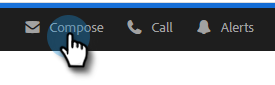

# Integración de Highspot {#highspot-integration}

Las ventas pueden acceder a las funciones de punto álgido desde las acciones de Insight de ventas y lograr una mayor visibilidad, eficacia y rendimiento a lo largo del ciclo de ventas. Los usuarios de acción de Sales Insight pueden seleccionar el contenido de ventas almacenado en la plataforma de habilitación de ventas de Highspot e insertarlo directamente en correos electrónicos, plantillas de correo electrónico y campañas de ventas, todo mientras capturan el seguimiento de contenido y el análisis dentro de las acciones de Highspot y Sales Insight.

## Habilitación de la integración de Highspot {#enabling-highspot-integration}

>[!NOTE]
>
>Debe tener privilegios de administrador para habilitar Highspot en la instancia de acciones de Sales Insight.

1. Haga clic en el icono del engranaje y seleccione **Configuración**.

   

1. En **Configuración de administración**, seleccione **General**.

   

1. Desplácese a la tarjeta **Integraciones** y haga clic en el control deslizante para habilitar la zona alta.

   

Ahora los usuarios verán una opción para seleccionar Punto álgido al seleccionar el botón de carga de contenido en la ventana de composición, el editor de plantillas y el editor de correo electrónico de campaña.

## Acceso al contenido de Highspot y uso compartido de contenido por correo electrónico {#accessing-highspot-content}

Acceda a la zona alta y añada contenido a los correos electrónicos desde la ventana de composición Acciones de Sales Insight, el editor de plantillas y el editor de correo electrónico de campañas de ventas. A continuación se indican los pasos para acceder al contenido desde la ventana de composición.

1. Cree su borrador de correo electrónico (existen varias formas de hacerlo; en este ejemplo seleccionamos **Componer** en el encabezado).

   

1. Rellene el campo Para e introduzca un Asunto.

   

1. Escriba su mensaje. Haga clic en el lugar del correo electrónico en el que desee insertar el contenido de la zona alta. Haga clic en la lista desplegable de flecha (junto al icono de imagen) y seleccione **Punto alto**.

   

1. Inicie sesión en su cuenta de Highspot (si aún no ha iniciado sesión).

   

1. Seleccione el contenido que desee y haga clic en el botón **Agregar contenido**.

   

   >[!TIP]
   >
   >Si no ve rápidamente el contenido que desea, utilice la barra de búsqueda de la parte superior.

   El contenido aparece como un vínculo en el correo electrónico. El destinatario puede hacer clic en el vínculo para verlo o descargarlo.

   

## Seguimiento de clics en contenido de Highspot {#tracking-clicks-on-highspot-content}

Cuando los destinatarios abran el contenido que envía, se le notificará en la fuente activa. La actividad se mostrará como un clic, con detalles sobre el vínculo de contenido. Además, las vistas del contenido y las descargas se rastrearán en Highspot.

