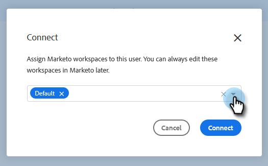

# Concesión de acceso a Marketo a usuarios {#grant-marketo-access-to-users}

Siga los pasos de este artículo para otorgar a los usuarios de ventas de Marketo acceso a la conexión de Marketo. Esto desbloqueará funciones como Momentos interesantes en la fuente en directo y acceso a campañas de marketing.

Necesitará [Ventas de Marketo](/help/marketo/product-docs/marketo-sales-insight/actions/admin/invite-users-and-admins.md#invite-users) antes de que sean visibles en la página Marketo > Acceso al equipo (en Marketo Sales), donde se concede acceso a la conexión de Marketo.

>[!CAUTION]
>
>Espere diez minutos después de conectar Marketo Sales con Marketo antes de realizar estos pasos.

1. Haga clic en el icono del engranaje y seleccione **Configuración**.

   

1. En Configuración de administración, haga clic en **Marketo**.

   

1. Haga clic en el **Acceso de usuarios** pestaña . Seleccione uno o varios usuarios y haga clic en **Connect**.

   

   >[!NOTE]
   >
   >La asignación de espacio de trabajo solo se puede realizar una vez al conceder acceso a los usuarios. Una vez configurado, tendrá que desconectar al usuario para cambiarlo.

1. Si la suscripción a Marketo tiene habilitados los espacios de trabajo, podrá asignar espacios de trabajo a cada usuario o conjunto de usuarios de forma masiva. Si no se seleccionan espacios de trabajo, se asignarán al espacio de trabajo predeterminado de Marketo.

   

   **PASO OPCIONAL**: Haga clic en la lista desplegable Espacio de trabajo y seleccione los espacios de trabajo que desee.

   

1. Haga clic en **Connect**.

   

Puede agregar usuarios adicionales desde la página Administración de equipos y seguir los pasos anteriores para conectarlos.
