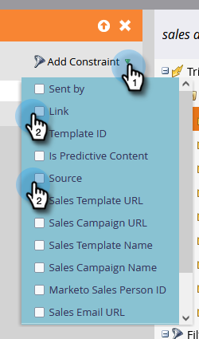

# Déclencheur y filtros de actividades de ventas {#sales-activity-triggers-and-filters}

Si busca coordinar mejor la participación con su equipo de ventas o si intenta obtener una mejor visión de cómo están interactuando con los clientes en todos los recorridos del comprador, las perspectivas de actividad de ventas en Marketo le serán útiles.

Siga los pasos a continuación para aprender a utilizar los filtros y déclencheur de actividad de ventas en sus campañas inteligentes.

1. Busque y seleccione la campaña inteligente que desee.

   

1. En el **Lista inteligente** , busque &quot;Aplicaciones de ventas&quot;.

   

1. Seleccione y arrastre el filtro o déclencheur deseado.

   

1. Seleccione las restricciones que desee.

   

>[!NOTE]
>
>Para obtener una lista completa de actividades, restricciones y definiciones, consulte nuestra [Glosario de actividades de las acciones de perspectiva de ventas](/help/marketo/product-docs/marketo-sales-insight/actions/marketo/sales-insight-actions-activity-glossary.md).
