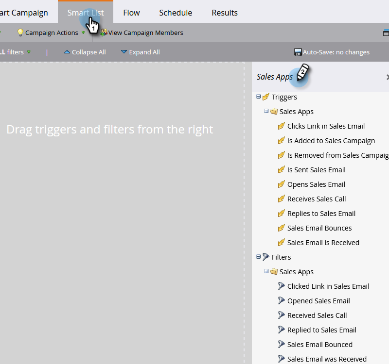

# Activador y filtros de actividades de ventas {#sales-activity-triggers-and-filters}

Si buscas una mejor coordinación de la participación con tu equipo de ventas o quieres tener una mejor visión de cómo interactúan con los clientes en todo el recorrido de compradores, las perspectivas de la actividad de ventas en Marketo te serán útiles.

Siga los pasos a continuación para aprender a utilizar los déclencheur y filtros de actividad de ventas en sus campañas inteligentes.

1. Busque y seleccione la campaña inteligente que desee.

   

1. En la ficha **[!UICONTROL Lista inteligente]**, busque &quot;[!UICONTROL Aplicaciones de ventas]&quot;.

   

1. Seleccione y arrastre el ratón sobre el déclencheur que desee.

   

1. Seleccione las restricciones que desee.

   

>[!NOTE]
>
>Para obtener una lista completa de actividades, restricciones y definiciones, consulte nuestro [[!DNL Sales Insight Actions] Glosario de actividades](/help/marketo/product-docs/marketo-sales-insight/actions/marketo/sales-insight-actions-activity-glossary.md).
