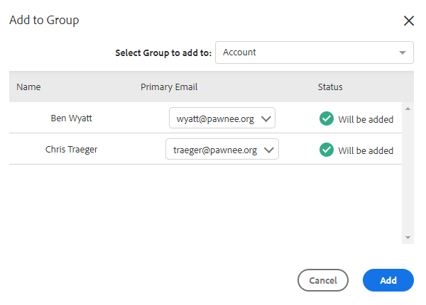

# Acciones masivas en personas {#bulk-actions-on-people}

Hay algunas cosas que puedes hacer con tus contactos de forma masiva para ahorrar tiempo.

El primer paso para todas las acciones masivas disponibles es seleccionar dos o más contactos y hacer clic en el punto (tres puntos verticales).

## Agregar Personas al Grupo {#add-people-to-group}

Agregar varias personas a un grupo al mismo tiempo.

## Origen {#source}

Asignamos automáticamente una fuente a cada contacto que entre en la base de datos. Siga este paso para actualizar el origen.

>[!NOTE]
>
>Las fuentes no se pueden personalizar.

## Autorización {#authorization}

De conformidad con el [RGPD](https://eugdpr.org/), use la autorización para indicar cómo obtuvo permiso para relacionarse con estos contactos.

## Cancelar suscripción {#unsubscribe}

Realizar una cancelación de suscripción masiva en los contactos que ya no desean recibir correspondencia suya.

