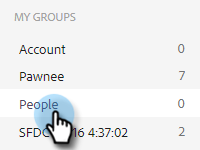
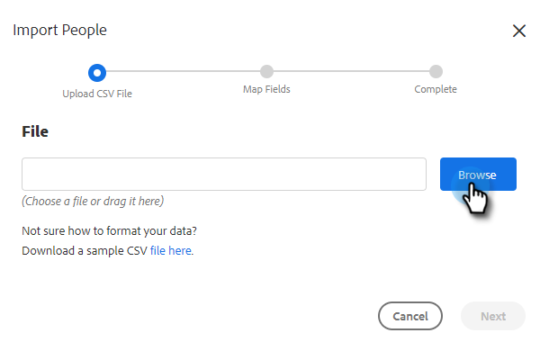

# Importar contactos a través de CSV {#import-contacts-via-csv}

Tener contactos en la página Personas es importante porque es desde donde extraemos para rellenar automáticamente información personalizada en los campos dinámicos de las plantillas. Asegúrese de tener al menos un nombre y una dirección de correo electrónico para cada contacto en el CSV y de asignarlos a esos campos.

1. Seleccione el grupo (o cree uno nuevo) en la pestaña Personas .

   

1. Haga clic en **Acciones de grupo** y seleccione **Importar CSV**.

   

1. Haga clic en **Examinar**.

   

1. Busque el archivo deseado en el equipo y selecciónelo.

   >[!NOTE]
   >
   >Los grupos están limitados a 1000 contactos.

1. Haga clic en **Siguiente**.

   

1. Asigne las columnas del CSV a sus respectivos campos en Conexión de ventas. Haga clic en **Siguiente** cuando haya terminado.

   
