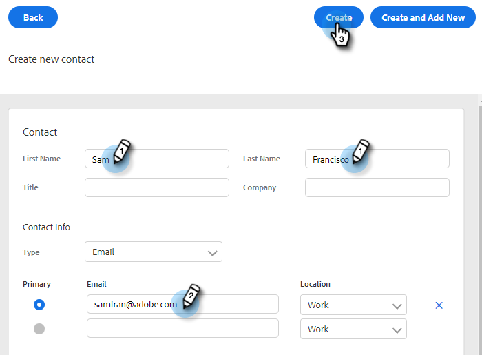

# Administrar grupos {#manage-groups}

Aprenda a administrar sus grupos en Acciones de perspectiva de ventas.

## Tipos de grupo {#group-types}

<table> 
 <colgroup> 
  <col> 
  <col> 
 </colgroup> 
 <tbody> 
  <tr> 
   <th>Grupo</th> 
   <th>Descripción</th> 
  </tr> 
  <tr> 
   <td>Todas las personas</td> 
   <td>Todos los contactos de todos los usuarios que son visibles para usted.</td> 
  </tr> 
  <tr> 
   <td>Grupos dinámicos</td> 
   <td>Mis contactos: Todos los contactos que posea. Cancelación de suscripción: Contactos que han optado por no recibir correspondencia.</td> 
  </tr> 
  <tr> 
   <td>Mis grupos</td> 
   <td>Grupos que ha creado. Pueden contener sus contactos o contactos que se han compartido con usted.</td> 
  </tr> 
  <tr> 
   <td>Grupos de equipos</td> 
   <td>Grupos que han sido compartidos con y/o por usted. Pueden contener contactos propios de sus compañeros de equipo o contactos que ha compartido con ellos.</td> 
  </tr> 
 </tbody> 
</table>

## Crear un grupo {#create-a-group}

1. En la página Personas , haga clic en el botón **+** junto a Grupos.

   

1. Asigne un nombre al grupo y haga clic en **Crear**.

   

   ¡Eso es todo!

## Agregar contactos a un grupo {#add-contacts-to-a-group}

1. En la página Personas, busque y seleccione el grupo al que desee agregar personas.

   

1. Haga clic en **Acciones de grupo** y seleccione **Crear contacto y agregar al grupo**.

   

   >[!NOTE]
   >
   >Esto agregará un contacto a la vez. Para agregar varios contactos al mismo tiempo, siga [estos pasos](/help/marketo/product-docs/marketo-sales-insight/actions/people/managing-contacts/import-contacts-via-csv.md).

1. Rellene la información del contacto y haga clic en **Crear** (o **Crear y agregar nuevo** para agregar otro).

   

   ¡Y ya terminaste!

   >[!NOTE]
   >
   >Es posible que tenga que hacer clic en actualizar para ver si se han agregado nuevos contactos.

## Compartir un grupo {#share-a-group}

1. En la página Personas, busque y seleccione el grupo que desee compartir.

   

1. Haga clic en los datos (tres puntos verticales) y seleccione **Compartir**.

   

1. Haga clic en la lista desplegable, elija el equipo con el que desea compartir el grupo y haga clic en **Compartir**.

   

   Usted sigue siendo el propietario del grupo, pero ahora aparece debajo de _Grupos de equipos_.

## Dejar de compartir un grupo {#unshare-a-group}

1. En la página Personas, busque y seleccione el grupo que desee dejar de compartir.

   

1. Haga clic en los datos (tres puntos verticales) y seleccione **Compartir**.

   

1. Haga clic en el **X** junto al equipo con el que compartió el grupo y, a continuación, haga clic en fuera del modal.

   

   El grupo ya no se comparte.

## Cambiar el nombre de un grupo {#rename-a-group}

1. En la página Personas, busque y seleccione el grupo cuyo nombre desea cambiar.

   

1. Haga clic en los datos (tres puntos verticales) y seleccione **Editar**.

   

1. Escriba el nuevo nombre y haga clic en **Guardar**.

   

## Eliminar un grupo {#delete-a-group}

1. En la página Personas, busque y seleccione el grupo que desee eliminar.

   

1. Haga clic en los datos (tres puntos verticales) y seleccione **Eliminar**.

   

1. Haga clic en **Eliminar** para confirmar.

   
