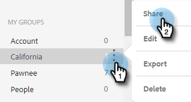

# Administrar grupos {#manage-groups}

Obtenga información sobre cómo administrar los grupos en [!DNL Sales Insight Actions].

## Tipos de grupos {#group-types}

<table>
 <colgroup>
  <col>
  <col>
 </colgroup>
 <tbody>
  <tr>
   <th>Grupo</th>
   <th>Descripción</th>
  </tr>
  <tr>
   <td>[!UICONTROL Todas las personas]</td>
   <td>Todos los contactos de todos los usuarios visibles para usted.</td>
  </tr>
  <tr>
   <td>[!UICONTROL Grupos dinámicos]</td>
   <td>Mis contactos: Todos los contactos que posee. Cancela la suscripción: contactos que han optado por no recibir correspondencia.</td>
  </tr>
  <tr>
   <td>[!UICONTROL Mis grupos]</td>
   <td>Grupos que ha creado. Pueden contener sus contactos o los contactos que se han compartido con usted.</td>
  </tr>
  <tr>
   <td>[!UICONTROL Grupos de equipo]</td>
   <td>Grupos que se han compartido con usted o que han compartido con usted. Pueden contener contactos de sus compañeros o contactos que haya compartido con ellos.</td>
  </tr>
 </tbody>
</table>

## Crear un grupo {#create-a-group}

1. En la página [!UICONTROL Personas], haga clic en **+** junto a [!UICONTROL Grupos].

   

1. Asigne un nombre al grupo y haga clic en **[!UICONTROL Crear]**.

   

   ¡Eso es todo!

## Agregar contactos a un grupo {#add-contacts-to-a-group}

1. En _Grupos_, seleccione **Todas las personas**.

   

1. Busque la persona o personas que desee agregar.

   

1. Haga clic en la casilla de verificación situada junto al nombre para seleccionarlos.

   

1. Haga clic en el icono de más acciones () y seleccione **Agregar personas al grupo**.

   

1. Seleccione el grupo al que desea agregarlos y haga clic en **Agregar**.

   

## Compartir un grupo {#share-a-group}

1. En la página [!UICONTROL Personas], busque y seleccione el grupo que desee compartir.

   

1. Haga clic en los puntos (tres puntos verticales) y seleccione **[!UICONTROL Compartir]**.

   

1. Haga clic en el menú desplegable, elija el equipo con el que desea compartir el grupo y haga clic en **[!UICONTROL Compartir]**.

   

   Sigue siendo el propietario del grupo, pero ahora aparecerá en _Grupos de equipo_.

## Dejar de compartir un grupo {#unshare-a-group}

1. En la página [!UICONTROL Personas], busque y seleccione el grupo que desea dejar de compartir.

   

1. Haga clic en los puntos (tres puntos verticales) y seleccione **[!UICONTROL Compartir]**.

   

1. Haga clic en **X** junto al equipo con el que compartió el grupo y luego haga clic fuera del modal.

   

   El grupo ya no se comparte.

## Cambiar nombre de grupo {#rename-a-group}

1. En la página [!UICONTROL Personas], busque y seleccione el grupo cuyo nombre desea cambiar.

   

1. Haga clic en los puntos (tres puntos verticales) y seleccione **[!UICONTROL Editar]**.

   

1. Escriba el nuevo nombre y haga clic en **[!UICONTROL Guardar]**.

   

## Eliminar un grupo {#delete-a-group}

1. En la página Personas, busque y seleccione el grupo que desea eliminar.

   

1. Haga clic en los puntos (tres puntos verticales) y seleccione **[!UICONTROL Eliminar]**.

   

1. Haga clic en **[!UICONTROL Eliminar]** para confirmar.

   
