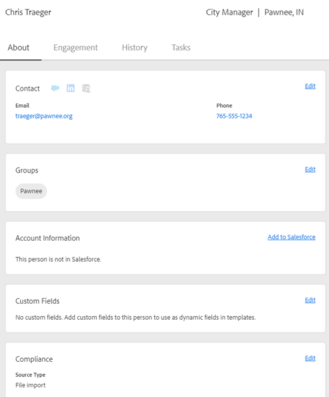

# Vista de detalle de persona {#person-detail-view}

La vista de detalles de persona proporciona un perfil detallado de cada persona en su cuenta de [!DNL Marketo Sales].

## Cómo acceder {#how-to-access}

1. Para obtener acceso a la vista de detalles de la persona, haga clic en la ficha **[!UICONTROL Personas]**.

   

1. Seleccione la persona que desee.

   

   >[!TIP]
   >
   >En casi cualquier lugar donde se ve el nombre de una persona, se puede hacer clic en él y llegar a su Vista de detalles de la persona.

## Pestaña Acerca de {#about-tab}

Incluye toda la información de contacto de la persona.

**Tarjeta de contacto**

* Contiene información de contacto como: dirección de correo electrónico, nombre, compañía, título, número de teléfono y vínculos a medios sociales

**Grupos**

* Muestra y administra los grupos a los que pertenece esta persona

**Información de la cuenta**

* Puede agregar una persona a [!DNL Salesforce]
* Extraer información de cuenta y de contacto/posible cliente de [!DNL Salesforce]

**Campos personalizados**

* Agregue o quite campos personalizados que se puedan usar como campos dinámicos en sus plantillas y campañas

**Cumplimiento**

* Texto

**Notas**

* Crear notas personalizadas

## Pestaña Participación {#engagement-tab}

Vea cómo esta persona interactúa con su alcance.

PICC

**Actividad de ventas de Marketo**

* Consulte las actividades de participación de sus campañas y correos electrónicos de ventas

**Actividad de marketing**

* Vea cómo se involucra su persona con las campañas de marketing

## Pestaña Historial {#history-tab}

Muestra su historial de divulgación. Incluye correos electrónicos, campañas y llamadas.

PICC

**Campañas de ventas**

* Ver todas las campañas activas o completadas a las que pertenece esta persona

**Campañas de marketing**

* Ver cualquier campaña de marketing a la que esté abonada esta persona

**Correos electrónicos de ventas**

* Ver los correos electrónicos que ha enviado a esta persona y las métricas de participación

**Llamadas de ventas**

* Ver las llamadas que ha realizado a esta persona

## Pestaña Tareas {#tasks-tab}

Administrar tareas asociadas con esta persona.

PICC

Acciones que puede realizar:

* Editar o eliminar una tarea
* Ver la fecha de vencimiento
* Haga clic en el Tipo para iniciar el teléfono de ventas si llama, Correo electrónico Maquetar si correo electrónico, LinkedIn si es Inmail y Nota personalizada si es Custom.
* Marcar una tarea como completada
