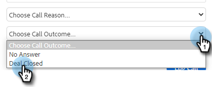

# Resultados de las llamadas {#call-outcomes}

Permita que sus equipos de ventas seleccionen los resultados de las llamadas al realizar llamadas, de modo que su equipo pueda comprender el impacto de los esfuerzos de participación de los clientes.

>[!NOTE]
>
>**Se requieren permisos de administración**

## Habilitar resultados de llamadas {#enable-call-outcomes}

1. Haga clic en el icono del engranaje y seleccione **Configuración**.

   

1. En Configuración de administración, seleccione **Marcador**.

   

1. Seleccione **Habilitar resultados de llamadas**.

   

1. Elija el requisito de resultado de llamada que desee.

   

## Crear resultados de llamada {#create-call-outcomes}

>[!NOTE]
>
>Puede crear un máximo de 15 resultados de llamada.

1. Haga clic en el icono del engranaje y seleccione **Configuración**.

   

1. En Configuración de administración, seleccione **Marcador**.

   

1. Haga clic en **Administrar resultados de llamadas**.

   

1. Introduzca el nombre del resultado de la llamada deseado en el campo de texto.

   

1. Haga clic en el menú desplegable Answered y elija el tipo de resultado (en este ejemplo, elegimos Answered). Luego haga clic en **Agregar**.

   

## Elegir un resultado de llamada {#choose-a-call-outcome}

Una vez habilitados los resultados de la llamada. Los usuarios pueden seleccionar una al realizar una llamada.

1. Haga clic en el botón de llamada para iniciar el marcador.

   

1. Escriba la información de la llamada en el marcador y haga clic en **Llamar**.

   

1. Seleccione el resultado de la llamada que mejor describa la llamada.

   

1. Finalice la llamada.

   

1. Registre la llamada.

   

>[!MORELIKETHIS]
>
>* [Registrar motivos de llamada y resultados de llamada a Salesforce](/help/marketo/product-docs/marketo-sales-insight/actions/phone/log-call-reasons-and-call-outcomes-to-salesforce.md)
>* [Motivos de llamada](/help/marketo/product-docs/marketo-sales-insight/actions/phone/call-reasons.md)
