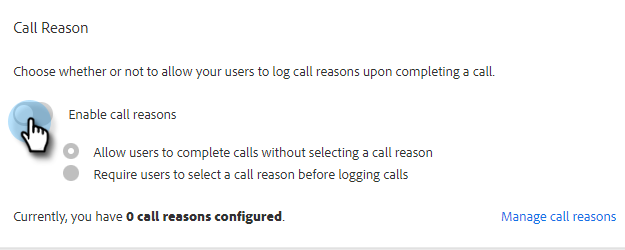
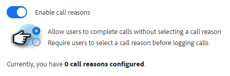
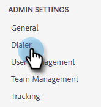

# Razones de llamada {#call-reasons}

Permita que sus equipos de ventas seleccionen motivos de llamada al realizar llamadas, de modo que su equipo pueda comprender por qué se realizan dichas llamadas.

>[!NOTE]
>
>**Permisos de administración necesarios**

## Habilitar motivos de llamada {#enable-call-reasons}

1. Haga clic en el icono del engranaje y seleccione **Configuración**.

   

1. En Configuración de administración, seleccione **Marcador**.

   

1. Seleccionar **Habilitar motivos de llamada**.

   

1. Elija el requisito del motivo de la llamada que desee.

   

## Crear motivo de llamada {#create-call}

>[!NOTE]
>
>Puede crear un máximo de 15 motivos de llamada.

1. Haga clic en el icono del engranaje y seleccione **Configuración**.

   

1. En Configuración de administración, seleccione **Marcador**.

   

1. Clic **Administrar motivos de llamada**.

   

1. Introduzca el nombre del motivo de la llamada deseado en el campo de texto y haga clic en **Añadir**.

   

## Seleccionar un motivo de la llamada {#select-a-call-reason}

Una vez habilitados los motivos de llamada. Los usuarios pueden seleccionar una al realizar una llamada.

1. Haga clic en el botón de llamada para iniciar el marcador.

   

1. Introduzca la información de la llamada en el marcador y haga clic en **Llamada**.

   

1. Seleccione el motivo de la llamada que mejor describa la llamada.

   

1. Finalice la llamada.

   

1. Registre la llamada.

   

>[!MORELIKETHIS]
>
>* [Registrar motivos de llamada y resultados de llamada a Salesforce](/help/marketo/product-docs/marketo-sales-insight/actions/phone/log-call-reasons-and-call-outcomes-to-salesforce.md)
>* [Resultados de llamadas](/help/marketo/product-docs/marketo-sales-insight/actions/phone/call-outcomes.md)
