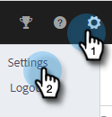

# Activar grabación de llamada {#enable-call-recording}

Como administrador, puede habilitar la grabación de llamadas para sus llamadas de acciones de perspectiva de ventas . La grabación de las llamadas de su equipo puede ser una buena forma de instruir a sus representantes de ventas sobre las mejores prácticas de llamadas.

1. Haga clic en el icono Configuración y seleccione **Configuración**.

   

1. En Configuración de administración, haga clic en **Marcador**.

   

1. Seleccione el **Habilitar grabación de llamada** alternar.

   

1. Si desea que los vendedores puedan activar o desactivar la grabación de llamadas por su cuenta, haga clic en **Grabación opcional para todos los integrantes del equipo**. Si desea que todas las llamadas se registren automáticamente, haga clic en **Registrar todas las llamadas**.

   

>[!MORELIKETHIS]
>
>[Configuración de consentimiento de dos partes](/help/marketo/product-docs/marketo-sales-insight/actions/phone/two-party-consent-settings.md)
