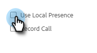

# Presencia local {#local-presence}

La presencia local le da la opción de hacer que parezca que llama desde el mismo código de área del destinatario.

## Seleccionar presencia local {#select-local-presence}

1. Haga clic en el icono del teléfono para abrir el Sales Dialer.

   

1. Seleccione la casilla de verificación **Usar presencia local**.

   

## Preguntas frecuentes {#faq}

**¿Puede mi contacto llamarme de vuelta a este nuevo número?**

No, la presencia local solo funciona para llamadas salientes. La persona que llama no puede devolverle la llamada a este &quot;nuevo&quot; número.

**¿Puedo llamar a cualquier lugar con presencia local?**

Ofrecemos toda la funcionalidad de teléfono de ventas solo para llamadas en los EE. UU.

**¿El número de presencia local es siempre el mismo cuando llamo a un código de área?**

Es probable que el número siempre sea el mismo cuando llama a un código de área.

**¿Cambia todo mi número o solo el código de área al usar la presencia local?**

Tu número entero cambiará.
