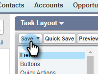
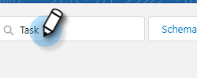

# Registrar motivos de llamada y resultados de llamada a Salesforce {#log-call-reasons-and-call-outcomes-to-salesforce}

Si desea registrar los resultados de las llamadas y los motivos de la llamada en Salesforce con fines de creación de informes o visibilidad, puede crear un campo de actividad personalizado para cada uno. Cada campo debe utilizar un Nombre de API específico (conocido como &quot;Nombre de campo&quot; en Salesforce).

* Nombre del campo Resultados de la llamada: mktosales_call_result
* Nombre del campo Razones de la llamada: mktosales_call_reason

Para utilizar estos campos, primero debe crear el campo como un campo de actividad personalizado. Para que sea visible para los usuarios, debe agregarlo al diseño de página del objeto de tarea.

## Salesforce Classic {#salesforce-classic}

### Crear campo de actividad personalizado en Salesforce Classic  {#create-custom-activity-field-in-salesforce-classic}

1. En Salesforce, haga clic **Configurar**.

   

1. Escriba &quot;Actividades&quot; en el cuadro Búsqueda rápida.

   

1. Clic **Campos personalizados de actividad**.

   

1. Clic **Nuevo**.

   

1. Seleccione el tipo de datos &quot;Texto&quot; y haga clic en **Siguiente**.

   

1. Asigne al campo personalizado el nombre del campo tal como se ha definido anteriormente. La longitud del campo tiene un límite de 255 caracteres. Etiqueta de campo será el campo visible para su equipo de ventas y se puede personalizar para satisfacer las necesidades de su equipo.

   

1. El resto de los ajustes son opcionales. Una vez completada la configuración, haga clic en **Siguiente**.

   

1. Seleccione la configuración de seguridad de nivel de campo que desee para este campo y haga clic en **Siguiente** (la imagen siguiente es solo un ejemplo).

   

   >[!NOTE]
   >
   >Asegúrese de que el campo personalizado esté visible para el perfil que utilizan los usuarios de Acciones de perspectiva de ventas, junto con cualquier otro lugar donde desee que esté visible.

1. Seleccione a qué diseños de página desea añadir el campo y haga clic en **Guardar** (opcionalmente, puede hacer clic en **Guardar y nuevo** y repita el proceso para el campo Razón de la llamada).

   

### Agregar un campo de actividad personalizado al diseño de página de la tarea en Salesforce Classic {#add-custom-activity-field-to-task-page-layout-in-salesforce-classic}

>[!NOTE]
>
>Solo tendrá que seguir estos pasos si no seleccionó el diseño de página deseado en el paso 9 anterior.

1. En Salesforce, haga clic **Configurar**.

   

1. Escriba &quot;Tarea&quot; en el cuadro Búsqueda rápida.

   

1. Clic **Diseños de página de tarea**.

   

1. Clic **Editar** junto al diseño de página de la tarea al que desea agregar este campo.

   

1. Arrastre y suelte el campo en la sección deseada del diseño de página de la tarea.

   

1. Clic **Guardar**.

   

## Salesforce Lightning {#salesforce-lightning}

### Crear campo de actividad personalizado en Salesforce Lightning {#create-custom-activity-field-in-salesforce-lightning}

1. En Salesforce, haga clic en el icono de engranaje en la parte superior derecha y seleccione **Configurar**.

   

1. Clic **Administrador de objetos**.

   

1. Escriba &quot;Actividad&quot; en el cuadro Búsqueda rápida.

   

1. Haga clic en **Actividad** etiqueta.

   

1. Clic **Campos y relaciones**.

   

1. Clic **Nuevo**.

   

### Agregar un campo de actividad personalizado al diseño de página de la tarea en Salesforce Lightning {#add-custom-activity-field-to-task-page-layout-in-salesforce-lightning}

1. En Salesforce, haga clic en el icono de engranaje en la parte superior derecha y seleccione **Configurar**.

   

1. Clic **Administrador de objetos**.

   

1. Escriba &quot;Tarea&quot; en el cuadro Búsqueda rápida.

   

1. Haga clic en **Tarea** etiqueta.

   

1. Clic **Diseños de página**.

   

1. Haga clic en Abrir el diseño de página de la tarea al que desee agregar este campo.

   

1. Arrastre y suelte el campo en la sección deseada del diseño de página de la tarea.

   

1. Clic **Guardar**.

   

>[!MORELIKETHIS]
>
>* [Resultados de llamadas](/help/marketo/product-docs/marketo-sales-insight/actions/phone/call-outcomes.md)
>* [Razones de llamada](/help/marketo/product-docs/marketo-sales-insight/actions/phone/call-reasons.md)
