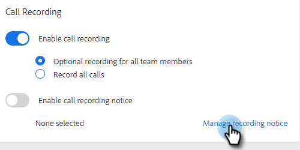
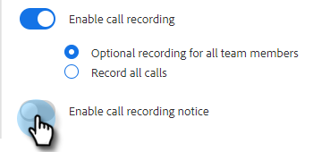

# Configuración de consentimiento de dos partes {#two-party-consent-settings}

Para garantizar el cumplimiento de las leyes de consentimiento de dos partes de EE. UU. al registrar llamadas, como administrador puede habilitar un mensaje pregrabado de su elección para que se reproduzca al principio de sus llamadas cuando se registre.

>[!PREREQUISITES]
>
>Antes de seguir los pasos que se indican a continuación, primero debe [habilitar la grabación de llamada](/help/marketo/product-docs/marketo-sales-insight/actions/phone/enable-call-recording.md).

1. Haga clic en el icono Configuración y seleccione **Configuración**.

   

1. En Configuración de administración, haga clic en **General**.

   

1. En la tarjeta de grabación de llamadas, haga clic en **Administrar aviso de grabación**.

   

1. Haga clic en **Importar grabación**.

   

   >[!NOTE]
   >
   >Solo se admiten archivos Wav y MP3. No se puede cargar un archivo que dure más de 30 segundos.

1. Seleccione los archivos de audio deseados de su disco duro.

   

1. Una vez finalizada la carga, seleccione los datos (tres puntos) en el administrador de archivos y haga clic en **Seleccionar como notificación de consentimiento**. Haga clic en **OK** cuando haya terminado.

   

1. Haga clic en el botón de alternancia para activar el mensaje seleccionado para que se reproduzca al principio de las llamadas grabadas.

   
