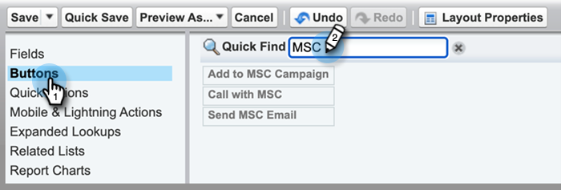

# Configuración de Salesforce {#salesforce-configuration}

## Desinstalación del paquete de personalización de Salesforce (Classic) {#uninstall-salesforce-customization-package-classic}

Desinstale el paquete Marketo Sales Connect de su cuenta de Salesforce una vez que empiece a utilizar el paquete MSI-Actions.

**Quitar campos de Conexión de ventas del diseño de página**

1. En Salesforce Classic, haga clic en **Configuración**.

   

1. En la navegación de la izquierda, en Generar, expanda (pero no haga clic en) Personalizar y, a continuación, Posibles clientes. A continuación, seleccione **Diseños de página**.

   

1. Haga clic en **Editar** junto a Diseño de posible cliente.

   

1. En la consola, seleccione **Campos**. En Búsqueda rápida, busque &quot;MSC&quot;. Todos los campos atenuados se han añadido al diseño de página. Tendrás que eliminarlos.

   

   >[!NOTE]
   >
   >Si ninguno de los campos está atenuado, significa que no los ha agregado al diseño de la página. Puede omitir esta sección.

1. Desplácese a la sección que tiene los campos personalizados de Conexión de ventas .

   

1. Hay 10 tipos de campos MSC que se pueden agregar a esta sección. Elimine todos los campos agregados o simplemente elimine toda la sección.

1. Haga clic en **Guardar rápidamente** cuando haya terminado.

   

**Quitar los botones de conexión de ventas de los diseños de página**

1. En la consola (paso 4 anterior), seleccione **Botones**. Buscar &quot;MSC&quot;. Todos los botones atenuados se han añadido a la sección de botones personalizados. Tendrás que eliminarlos.

   

   >[!NOTE]
   >
   >Si ninguno de los botones está atenuado, significa que no los ha añadido. Puede omitir esta sección.

1. Arrastre y suelte los botones MSC de la sección Botones personalizados en la consola.

   

1. Haga clic en **Guardar rápidamente** cuando haya terminado.

   

**Quitar campos de conexión de ventas de la sección Historial de actividades**

1. Desplácese hasta la parte inferior de la página hasta la sección de lista relacionada con el historial de actividades y haga clic en el icono de llave inglesa.

   

1. A continuación, seleccione los campos de conexión de ventas en el área Campos seleccionados y haga clic en la flecha Eliminar. Haga clic en **OK** cuando haya terminado.

   

   >[!NOTE]
   >
   >MSE de abreviación _es_ Conexión de ventas. Es solo el nombre anterior, &quot;Participación de ventas de Marketo&quot;.

1. Haga clic en **Guardar** cuando haya terminado con la página Posibles clientes .

**Quitar los botones de acción masiva de conexión de ventas de la vista de lista de posibles clientes**

1. En la navegación de la izquierda, en Generar, expanda (pero no haga clic en) Personalizar y, a continuación, Posibles clientes. A continuación, seleccione **Buscar diseños**.

   

1. Junto a la Vista de lista de posibles clientes, haga clic en **Editar**.

   

1. Select **Agregar a MSC Campaign (Classic)**, **Correo electrónico con MSC (Classic)** y **Insertar en MSC (Classic)** y haga clic en la flecha Quitar . A continuación, haga clic en **Guardar**.

   

Ya no debería ver los botones en la vista de lista de posibles clientes.

**Eliminar la configuración de MSC para contactos**

1. En Salesforce, haga clic en **Configuración**.

1. En la barra de navegación de la izquierda, en Generar, expanda (pero no haga clic en) Personalizar y, a continuación, en Contactos. A continuación, seleccione **Diseños de página**.

1. Junto a Diseño de contacto, haga clic en **Editar**.

1. Repita los pasos de las tres secciones.

**Eliminar la configuración de MSC para la oportunidad**

1. En Salesforce, haga clic en **Configuración**.

1. En la navegación de la izquierda, en Generar, expanda (pero no haga clic en) Personalizar y, a continuación, Oportunidades. A continuación, seleccione **Diseños de página**.

1. Junto a Diseño de oportunidad, haga clic en **Editar**.

1. Repita los pasos de las tres secciones.

La vista de oportunidad solo tiene un botón - &quot;Enviar correo electrónico MSE&quot; y los campos siguientes:

**Quitar la configuración de MSC de la cuenta**

1. En Salesforce, haga clic en **Configuración**.

1. En la barra de navegación de la izquierda, en Generar, expanda (pero no haga clic en) Personalizar y, a continuación, en Cuenta. A continuación, seleccione **Diseños de página**.

1. Junto a Diseño de cuenta, haga clic en **Editar**.

1. Repita los pasos de las tres secciones.

La vista de cuenta solo tiene un botón - &quot;Enviar correo electrónico MSE&quot; y los campos siguientes:

**Quitar bandeja de salida de ventas de Marketo**

1. En Salesforce, haga clic en la **+** en la parte superior de la pantalla.

1. Haga clic en **Personalizar mis fichas**.

1. Seleccione la opción Bandeja de salida de ventas de Marketo a la derecha. Haga clic en la flecha Eliminar y, a continuación, haga clic en **Guardar**.

**Eliminar paquete de conexión de ventas**

Una vez que haya eliminado todos los objetos de su cuenta de Salesforce, siga los pasos a continuación.

1. En Salesforce, haga clic en **Configuración**.

1. En el cuadro Búsqueda rápida, introduzca &quot;Clases de apéndice&quot;.

1. Haga clic en **Eliminar** junto a todas las entradas &quot;MarketoSalesConnectionCustomization&quot; o &quot;MarketoSalesEngageCustomization&quot; en su lista.

¡Ya está todo!

Esta es una lista de todos los objetos que deben eliminarse de la instancia de Salesforce:

**Detalles de personalización de Conexión de Ventas**

<table>
 <tr>
  <th>Campos de actividad personalizados</th>
  <th>Descripción</th>
  <th>Tipo</th>
  <th>Tipo de datos</th>
 </tr>
 <tr>
  <td>ID de presencia local de llamada de MSC</td>
  <td>Como usuario, puedo elegir Presencia local como opción cuando hago llamadas desde MSC Phone. Las llamadas entrantes mostrarán un número local para el receptor</td>
  <td>Actividad</td>
  <td>Texto</td>
 </tr>
 <tr>
  <td>URL de grabación de llamada MSC</td>
  <td>Las llamadas se pueden registrar y un enlace para la grabación se registrará aquí </td>
  <td>Actividad</td>
  <td>Texto</td>
 </tr>
 <tr>
  <td>Campaña MSC</td>
  <td>Nombre de registro de la campaña de MSC en la que se encuentra el contacto/posible cliente</td>
  <td>Actividad</td>
  <td>Texto</td>
 </tr>
 <tr>
  <td>URL de campaña de MSC</td>
  <td>Registra la dirección URL de la campaña creada en MSC. Al hacer clic en esto, se abrirá la campaña en la aplicación web de MSC</td>
  <td>Actividad</td>
  <td>Texto</td>
 </tr>
 <tr>
  <td>Paso actual de la campaña MSC</td>
  <td>Si un contacto o posible cliente está en una campaña, este campo registrará el nombre del paso en el que se encuentra actualmente.</td>
  <td>Actividad</td>
  <td>Casilla de verificación</td>
 </tr>
 <tr>
  <td>Archivos adjuntos de correo electrónico de MSC vistos</td>
  <td>Registra los datos cuando se envía un correo electrónico con un archivo adjunto que el destinatario ve</td>
  <td>Actividad</td>
  <td>Casilla de verificación</td>
 </tr>
 <tr>
  <td>Correo electrónico de MSC en el que se hizo clic</td>
  <td>Registra una marca de verificación cuando el destinatario hace clic en un vínculo del correo electrónico</td>
  <td>Actividad</td>
  <td>Casilla de verificación</td>
 </tr>
 <tr>
  <td>Correo electrónico de MSC respondido</td>
  <td>Registra una marca de verificación cuando el destinatario responde al correo electrónico</td>
  <td>Actividad</td>
  <td>Texto</td>
 </tr>
 <tr>
  <td>Estado de correo electrónico de MSC</td>
  <td>Muestra si se envía/está en curso/si se devuelve un correo electrónico (el seguimiento de los correos electrónicos devueltos depende del canal de envío utilizado)</td>
  <td>Actividad</td>
  <td>Texto</td>
 </tr>
 <tr>
  <td>Plantilla de correo electrónico de MSC</td>
  <td>Nombre de registro de la plantilla MSC que se utilizó en el correo electrónico enviado al posible cliente o contacto</td>
  <td>Actividad</td>
  <td>Texto</td>
 </tr>
 <tr>
  <td>URL de plantilla de correo electrónico de MSC</td>
  <td>Registra la dirección URL de la plantilla creada en MSC. Al hacer clic en esto, se abrirá la plantilla en la aplicación web de MSC</td>
  <td>Actividad</td>
  <td>Texto</td>
 </tr>
 <tr>
  <td>URL de correo electrónico de MSC</td>
  <td>Al hacer clic en esta dirección URL, se abrirá el centro de comandos en MSC y se abrirá la ficha Historial de vista de detalles de personas , donde el usuario puede ver el correo electrónico enviado</td>
  <td>Actividad</td>
  <td>Texto</td>
 </tr>
 <tr>
  <td>Correo electrónico de MSC visitado</td>
  <td>Registra una marca de verificación cuando el destinatario ve un correo electrónico</td>
  <td>Actividad</td>
  <td>Casilla de verificación</td>
 </tr>
</table>

<table>
 <tr>
  <th>Campo de registro de resumen de MSC</th>
  <th>Descripción</th>
  <th>Tipo</th>
  <th>Tipo de datos</th>
 </tr>
 <tr>
  <td>MSC: último compromiso de marketing</td>
  <td>Última participación entrante desde Marketing</td>
  <td>
  
Cuenta 
  
Contacto 
  
Cliente potencial 
  
Oportunidad</td>
  <td>Datos y hora</td>
 </tr>
 <tr>
  <td>MSC: Última fecha de compromiso de marketing</td>
  <td>Marca de tiempo de participación de Marketing</td>
  <td>
  
Cuenta 
  
Contacto 
  
Cliente potencial 
  
Oportunidad</td>
  <td>Datos y hora</td>
 </tr>
 <tr>
  <td>MSC: Desc de último compromiso de marketing</td>
  <td>Descripción de la participación</td>
  <td>
  
Cuenta 
  
Contacto 
  
Cliente potencial 
  
Oportunidad</td>
  <td>Texto</td>
 </tr>
 <tr>
  <td>MSC: última fuente de participación de marketing</td>
  <td>Fuente de la participación de Marketing</td>
  <td>
  
Cuenta 
  
Contacto 
  
Cliente potencial 
  
Oportunidad</td>
  <td>Texto</td>
 </tr>
 <tr>
  <td>MSC: último tipo de compromiso de marketing</td>
  <td>Tipo de participación (por ejemplo: Actividad web)</td>
  <td>
  
Cuenta 
  
Contacto 
  
Cliente potencial 
  
Oportunidad</td>
  <td>Texto</td>
 </tr>
 <tr>
  <td>MSC: última actividad por ventas</td>
  <td>Última actividad saliente realizada por el equipo de ventas</td>
  <td>
  
Cuenta 
  
Contacto 
  
Cliente potencial 
  
Oportunidad</td>
  <td>Datos y hora</td>
 </tr>
 <tr>
  <td>MSC: última respuesta</td>
  <td>Última respuesta de correo electrónico al correo electrónico de ventas</td>
  <td>
  
Cuenta 
  
Contacto 
  
Cliente potencial 
  
Oportunidad</td>
  <td>Datos y hora</td>
 </tr>
 <tr>
  <td>MSC: Campaña de ventas actuales</td>
  <td>Nombre de registro de la campaña de MSC en la que se encuentra el contacto/posible cliente</td>
  <td>
  
Cuenta 
  
Contacto 
  
Cliente potencial 
  
Oportunidad</td>
  <td>Texto</td>
 </tr>
 <tr>
  <td>MSC: último compromiso de ventas</td>
  <td>Última contratación entrante de Ventas</td>
  <td>
  
Cuenta 
  
Contacto 
  
Cliente potencial 
  
Oportunidad</td>
  <td>Datos y hora</td>
 </tr>
 <tr>
  <td>MSC: exclusión</td>
  <td>Campo Exclusión</td>
  <td>
  
Cuenta 
  
Contacto 
  
Cliente potencial 
  
Oportunidad</td>
  <td>Casilla de verificación</td>
 </tr>
</table>

<table>
 <tr>
  <th>Botones MSC</th>
  <th>Descripción</th>
  <th>Tipo</th>
 </tr>
 <tr>
  <td>Enviar correo electrónico de MSC</td>
  <td>Enviar correos electrónicos de ventas desde Salesforce</td>
  <td>
  
Cuenta 
  
Contacto 
  
Cliente potencial 
  
Oportunidad</td>
 </tr>
 <tr>
  <td>Añadir a la campaña de MSC</td>
  <td>Agregar a campañas de MSC desde Salesforce</td>
  <td>
  
Contacto
  
Cliente potencial</td>
 </tr>
 <tr>
  <td>Insertar en MSC</td>
  <td>Insertar contacto de Salesforce a MSC</td>
  <td>
  
Contacto
  
Cliente potencial</td>
 </tr>
 <tr>
  <td>Llame a con MSC</td>
  <td>Realizar llamadas de ventas desde Salesforce</td>
  <td>
  
Contacto
  
Cliente potencial</td>
 </tr>
</table>

<table>
 <tr>
  <th>Botones de acción masiva de MSC</th>
  <th>Descripción</th>
  <th>Tipo</th>
 </tr>
 <tr>
  <td>Agregar a MSC Campaign (Classic)</td>
  <td>Agregar a campañas de MSC desde Salesforce</td>
  <td>
  
Contacto
  
Cliente potencial</td>
 </tr>
 <tr>
  <td>Insertar en MSC (Classic)</td>
  <td>Insertar contacto de Salesforce a MSC</td>
  <td>
  
Contacto
  
Cliente potencial</td>
 </tr>
 <tr>
  <td>Correo electrónico con MSC (Classic)</td>
  <td>Correo electrónico con MSC de Salesforce</td>
  <td>
  
Contacto
  
Cliente potencial</td>
 </tr>
</table>
