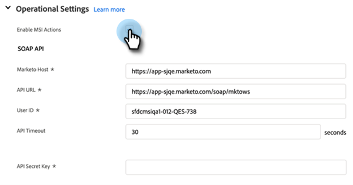

# Configuración de acciones de perspectiva de ventas en Salesforce {#sales-insight-actions-configuration-in-salesforce}

>[!PREREQUISITES]
>
>* [Instalar](/help/marketo/product-docs/marketo-sales-insight/msi-for-salesforce/installation/install-marketo-sales-insight-package-in-salesforce-appexchange.md) o [Actualización](/help/marketo/product-docs/marketo-sales-insight/msi-for-salesforce/upgrading/upgrading-your-msi-package.md) Paquete de perspectivas de ventas en su instancia de Salesforce
>* [Configurar la perspectiva de ventas de Marketo en Salesforce Enterprise/Unlimited](/help/marketo/product-docs/marketo-sales-insight/msi-for-salesforce/configuration/configure-marketo-sales-insight-in-salesforce-enterprise-unlimited.md)

## Agregar nuevo sitio remoto en Salesforce {#add-new-remote-site-in-salesforce}

1. En Salesforce, haga clic en **Configuración**.

   

1. Busque &quot;sitio remoto&quot; y seleccione **Configuración del sitio remoto**.
   

1. Haga clic en **Nuevo sitio remoto**.

   

1. Introduzca el Nombre del sitio remoto (puede ser algo así como &quot;MarketoSalesInsight&quot;). Introduzca la dirección URL del sitio remoto (https://ims-na1-stg1.adobelogin.com) y haga clic en **Guardar**.

   

## Activación de las acciones de perspectiva de ventas en CRM {#enabling-sales-insight-actions-across-the-crm}

1. En Salesforce, haga clic en la **Configuración de perspectiva de ventas de Marketo** pestaña .

   

   >[!NOTE]
   >
   >Si no ve &quot;Marketo Sales Insight Config&quot; en la barra superior, haga clic en el botón **+** marque y busque en Todas las pestañas.

1. Seleccione el **Habilitar acciones MSI** casilla de verificación.

   

1. Introduzca la clave secreta de API.

   

   >[!NOTE]
   >
   >Si no tiene la clave secreta de API a mano, puede encontrarla siguiendo los pasos de [este artículo](/help/marketo/product-docs/marketo-sales-insight/msi-for-salesforce/configuration/configure-marketo-sales-insight-in-salesforce-enterprise-unlimited.md).

1. Haga clic en **Guardar** cuando haya terminado.

Esto habilitará automáticamente todas las funciones de Acciones MSI descritas en el artículo de descripción general de la función.

>[!NOTE]
>
>Puede desactivar todas las funciones de acciones MSI simplemente desmarcando la casilla de verificación &quot;Habilitar acciones MSI&quot;.

## Administración de MSI-Actions {#msi-actions-governance}

1. Puede desactivar las campañas de ventas o la pestaña Tarea en la sección siguiente. Esto se aplicará a los paneles de posibles clientes, contactos, cuentas y oportunidades.

   

1. Puede desactivar las acciones MSI desmarcando las funciones correspondientes en Configuración de acciones .

   

>[!NOTE]
>
>La configuración de administración se aplica a todos los usuarios de MSI.
