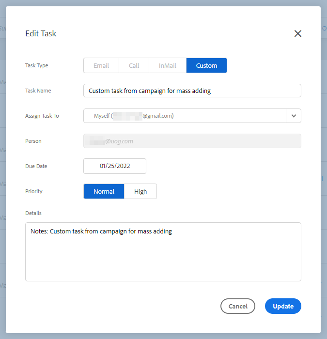

# Sincronización de tareas de recordatorio con Salesforce {#reminder-task-sync-with-salesforce}

>[!NOTE]
>
>Para aprender a habilitar la sincronización de tareas, consulte [Sincronizar acciones de perspectivas de ventas Tareas/recordatorios con tareas de Salesforce](/help/marketo/product-docs/marketo-sales-insight/actions/crm/salesforce-integration/salesforce-sync-settings.md#sync-sales-insight-actions-tasks-reminders-to-salesforce-tasks).

Una vez habilitada la configuración de sincronización de tareas, los usuarios verán sus tareas de recordatorio sincronizadas bidireccionalmente con Salesforce. Esto significa que los usuarios pueden administrar las tareas desde Salesforce o las acciones de perspectiva de ventas y confiar en que los sistemas permanecerán alineados.

## Sincronización de campos de tareas de recordatorio {#reminder-task-field-sync}

A continuación se muestra una lista de los campos de tareas recordatorias en Acciones de perspectiva de ventas y sus correspondientes campos de Salesforce que se admiten mediante la sincronización de tareas bidireccional.

<table>
 <tr>
  <th>Campo de tarea Acciones de Insight de Ventas</th>
  <th>Campo de tarea de Salesforce</th>
  <th>Tarea de Salesforce</th>
 </tr>
 <tr>
  <td>Nombre de la tarea</td>
  <td>Campo Asunto</td>
  <td>Campo de resumen breve que muestra el título de la tarea.</td>
 </tr>
 <tr>
  <td>Estado</td>
  <td>Estado de la tarea</td>
  <td>
Muestra el estado de la tarea. Las tareas Acciones de Insight de ventas tienen dos estados que se asignan a dos de los valores de la lista de selección de estado de la tarea de Salesforce.

  
Abrir en Acciones de perspectivas de ventas = No iniciado en Salesforce.

  
Completar en Acciones de Insight de Ventas = Completado en Salesforce.

  
Los demás valores de estado de Salesforce no se sincronizarán con las acciones de perspectiva de ventas.
</td>
 </tr>
 <tr>
  <td>Prioridad</td>
  <td>Prioridad</td>
  <td>
La prioridad de las acciones de perspectiva de ventas puede ser Normal o Alta, lo que se corresponde con los valores de prioridad Normal y Alta de Salesforce.

  
El valor de prioridad bajo de Salesforce no se sincronizará con las acciones de perspectiva de ventas.
</td>
 </tr>
 <tr>
  <td>Fecha de vencimiento</td>
  <td>Fecha de vencimiento</td>
  <td>La fecha de vencimiento de la tarea.</td>
 </tr>
 <tr>
  <td>Detalles</td>
  <td>Comentarios</td>
  <td>Muestra información más detallada sobre lo que estaba pensado para completarse con la tarea de recordatorio.</td>
 </tr>
</table>

## Sincronización de las tareas de las acciones de perspectiva de ventas con Salesforce por primera vez {#syncing-sales-insight-actions-tasks-with-salesforce-for-the-first-time}

Cuando activa por primera vez la sincronización entre las acciones de perspectiva de ventas y las tareas de Salesforce, importamos sus tareas de Salesforce. Nosotros **not** traspase cualquier tarea actual que tenga en Acciones de perspectivas de ventas a Salesforce. Para reducir el desorden y los duplicados, las únicas tareas que se sincronizan desde las acciones de perspectiva de ventas a Salesforce son las tareas creadas *after* sincroniza las acciones de perspectiva de ventas con SFDC.

Esto es lo que sucede cuando sincroniza las acciones de perspectivas de ventas y las tareas de SFDC:

* Tan pronto como haga clic en guardar en la sincronización de tareas, empezarán a sincronizarse. Inicialmente, esto llevará algún tiempo.

* Cualquier recordatorio que se haya actualizado o creado en las últimas 24 horas se extraerá de SFDC a las acciones de perspectiva de ventas. La sincronización se basa en la fecha de vencimiento y todas esas tareas se sincronizarán en el back-end, pero en el centro de comandos solo verá las tareas que vencen hoy y mañana.

* Si la sincronización se ha activado anteriormente y elimina cualquier tarea en SFDC, todo lo que se haya eliminado en los últimos 15 días se eliminará del Centro de comandos.

* Sincronizaremos tareas constantemente entre las acciones de perspectiva de ventas y SFDC siempre y cuando la sincronización esté habilitada.

Después de la sincronización inicial, cualquier tarea que cree, edite, complete o elimine en las acciones de perspectiva de ventas se sincronizará con la lista de tareas de Salesforce. Y todo lo que se cree, edite, complete o elimine en Salesforce actualizará su lista de tareas en Acciones de Insight de Ventas.

Para activar esta sincronización, marque la casilla de sincronización en su [Página Configuración](https://toutapp.com/login) en la aplicación web.

>[!NOTE]
>
>El campo de asunto de una tarea se puede actualizar en Acciones de perspectiva de ventas y esa actualización se sincronizará en el campo de asunto Salesforce para la tarea sincronizada correspondiente, si está utilizando la variable `{{activity_subject}}` el campo dinámico del [Personalización de los detalles de la actividad](/help/marketo/product-docs/marketo-sales-insight/actions/crm/salesforce-integration/configure-salesforce-activity-detail-customization.md) configuración. Por el contrario, cualquier actualización realizada en el campo de asunto en Salesforce _not_ sincronice con el campo de asunto de la tarea recordatorio de acciones de perspectiva de ventas .
