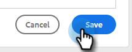

# Añadir texto con hipervínculos {#add-hyperlinked-text}

Siga los pasos a continuación para aprender a añadir hipervínculos a sus plantillas de correo electrónico.

1. En la página [!UICONTROL Plantillas], seleccione la plantilla que desee (o cree una nueva).

   

1. Haga clic en **[!UICONTROL Editar]**.

   

1. Escriba el texto que desea hipervincular (por ejemplo, &quot;Haga clic aquí&quot;). [!DNL Highlight] lo ha eliminado y ha hecho clic en el botón de vínculo en el editor.

   

1. Escriba la dirección URL a la que desea vincular (por ejemplo: `https://experienceleague.adobe.com/docs/marketo/using/home.html?lang=es`). Elija si quiere que la dirección URL se abra en la misma ventana o en otra nueva y haga clic en **[!UICONTROL Guardar]**.

   

1. Vuelva a hacer clic en **[!UICONTROL Guardar]**.

   

>[!NOTE]
>
>Si la plantilla que edita se está utilizando actualmente como un paso de correo electrónico en cualquier campaña, se le dará la opción de actualizar la redacción para campañas específicas (o todas).
